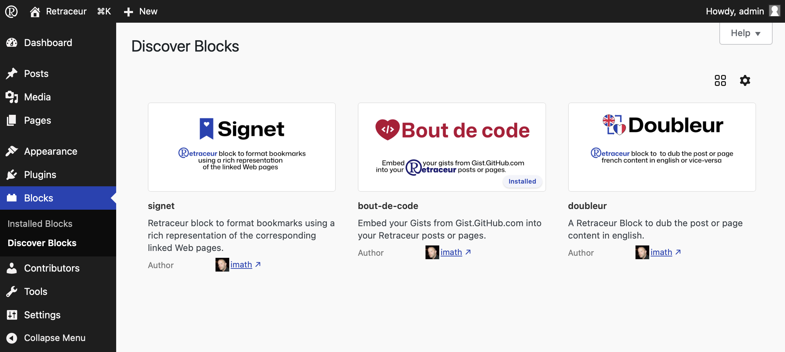
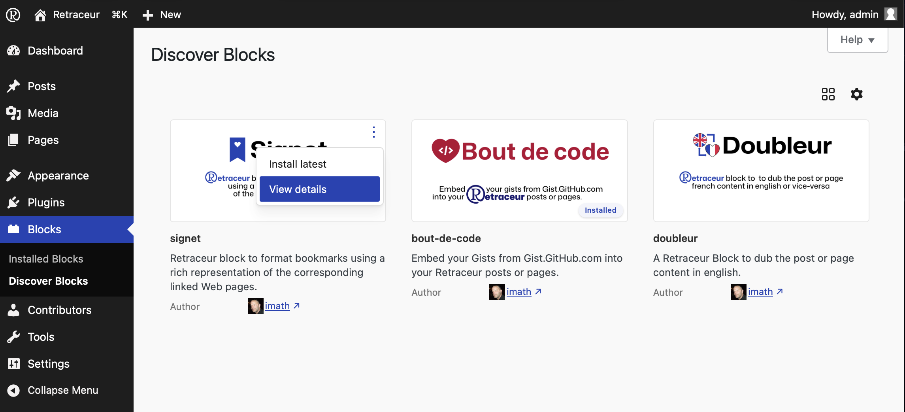
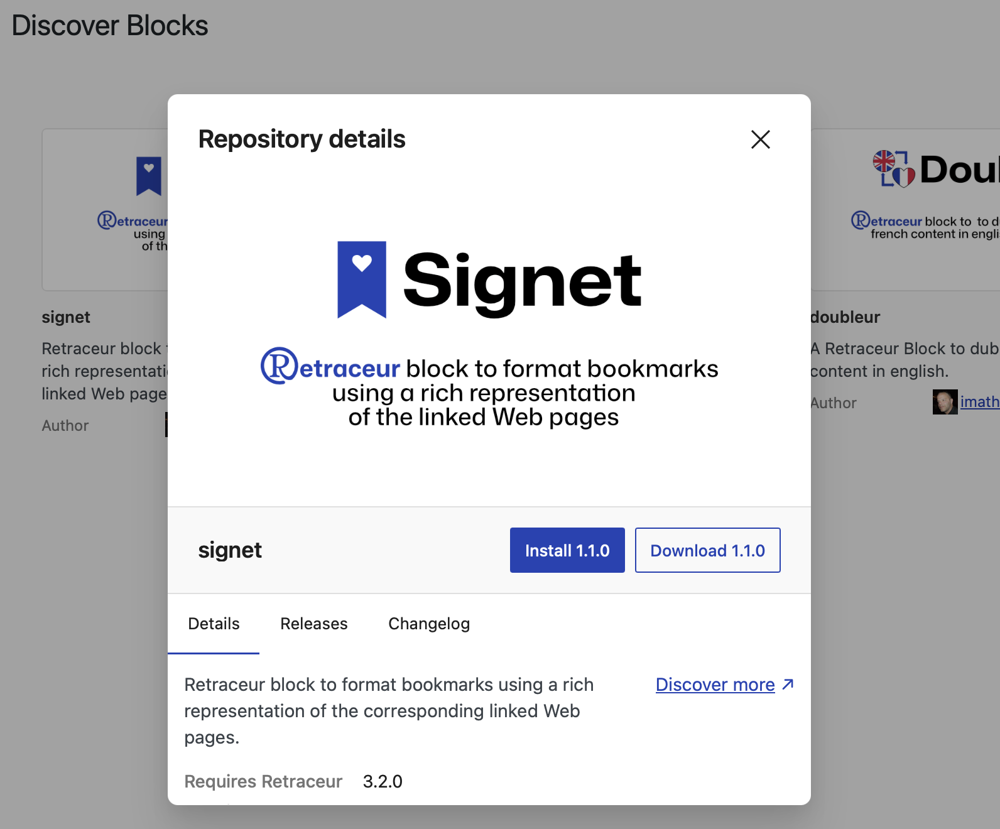
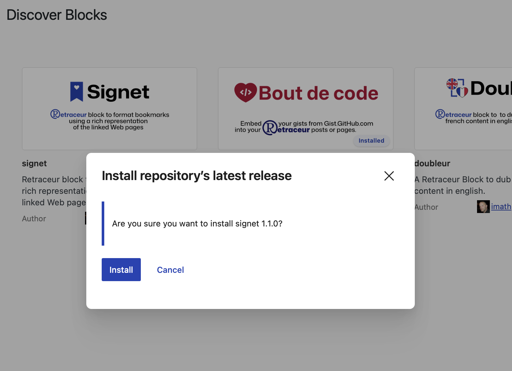
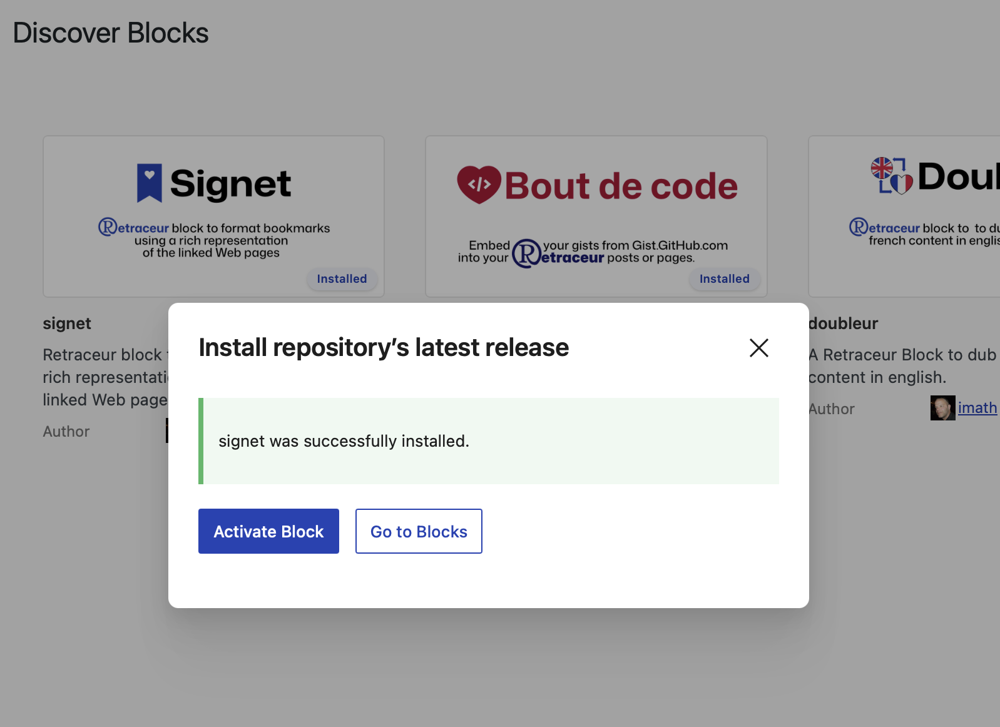

import { Aside } from '@astrojs/starlight/components';

In the Blocks administration area, the “Discover Blocks” submenu lets you browse — directly from Retraceur — the blocks shared via [GitHub](https://github.com/topics/retraceur-block) by developers who, like you, have decided to use Retraceur.

## An Exploration That Must Be Conducted with Caution

<Aside type="caution" title="Caution">The inclusion of information about these blocks in your Administration is not subject to moderation or regular security checks of the code used by developers. Retraceur simply facilitates access to resources that you would find directly on the [GitHub](https://github.com/topics/retraceur-block) website. So please take the time to carefully review all the information provided in the block’s details (e.g., required Retraceur version, number of open issues, stars, etc.).</Aside>

Here is the dynamic interface that you can view by visiting the Retraceur block discovery page.

Each block listed provides information about its name, description, and author. The author's name includes a link to learn more about them.

When you hover over the top-right corner of each image representing a block, a button to view more (three small vertical dots) appears, allowing you to install the block directly or read more details about it. 

<Aside type="caution" title="Recommendation">It is strongly recommended that you always review the block details before beginning its installation.</Aside>

### Block details

The first tab, “Details”, displays the block’s description again, as well as important information:

- The version of Retraceur required to run this block,
- The PHP version required to run this block,
- The date of its latest update,
- The number of stars the block has received,
- The number of currently open (unresolved) issues.

Additionally, the “Discover More” link allows you to open a new window to the block’s GitHub page so you can report an issue if necessary.

### Versions & changelog

These two tabs provide information about the maturity and consistency of the block's maintenance.

<Aside type="tip">By clicking on the image representing the block or on its title, you can also access detailed information about the block.</Aside>

## Installing a Block

As shown in the two screenshots above, you can start the block installation process by using the “Install” action of the button to view more options or by clicking the “Install X.Y.Z” button (where X.Y.Z is the block's version number) of the details modal. Once you click either of these two buttons, a new modal window will appear asking you to confirm that you want to install the block.

When you click the “Install” button, the installation begins, and after a few seconds, this window will update to show you the result of the operation.

If everything goes smoothly, you'll be prompted to either activate the block or view the [block management page](./manage-blocks).

## Support Contacts for a Block

<Aside type="danger" icon="github" title="Support">If you encounter any issues with a block, please contact the developers who created it and [self-listed](../../plugins/publish) it as compatible with Retraceur. Contact them directly via the URL of their GitHub repository by reporting the issue you’re experiencing.</Aside>