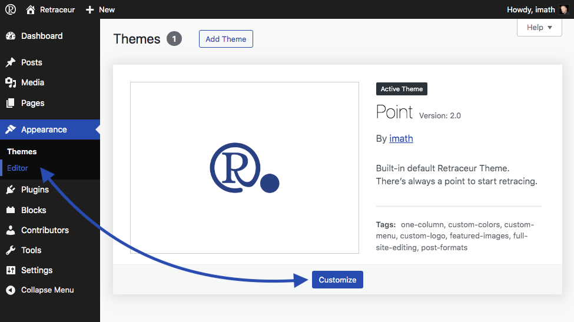
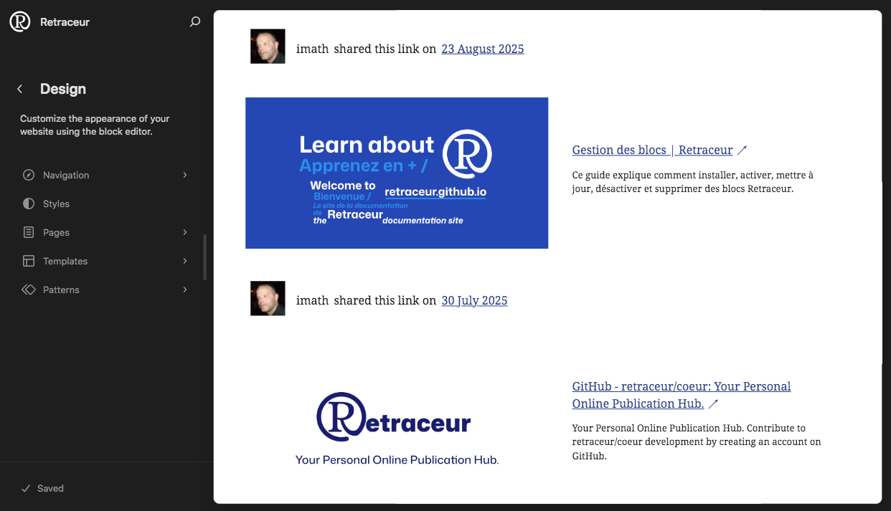

The Site editor lets you adjust the design of the entire site including the header, footer, and everything in between, with blocks. It gives you a complete control over how your site looks.

## Opening the Site Editor

To launch the Site Editor, you can:

- Click the "Editor" submenu in the "Appearance" menu of your dashboard.
- Click the "Customize" button that appears in the active theme box of the list of your installed themes.

## Managing your site main navigation

TBD

## Managing your site styles

TBD

## Customizing your site templates

TBD

## Editing your site patterns

TBD