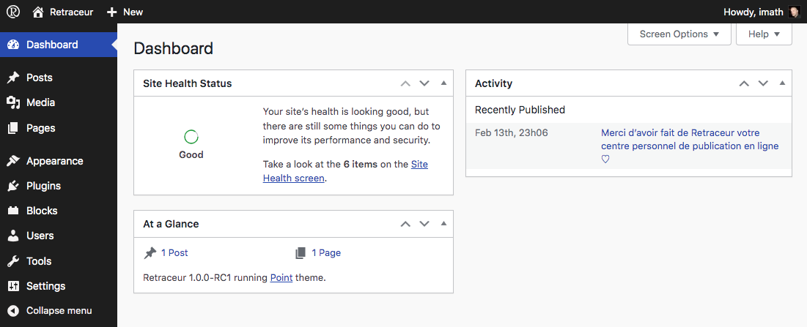

As shown above, the main Administration menu is located into the left column (black background). Each element of this menu is described below.

## Dashboard landing page

By default this page shows 3 Dashboard widgets:

- The **Site Health Status** widget gives you an overview of the current state of your website and if any parts of it needs improvements. It includes a shortcut to reach the Site Health Administration page which is also available as a Tools subpage.
- The **At A Glance** widget displays a summary of the content on your site and identifies which theme and version of Retraceur you are using.
- The **Activity** widget shows the upcoming scheduled posts as well as the recently published posts.

## Dashboard Updates page

This is the place where you are noticed when a new version of Retraceur is available. When it's a major version, the "Updates" sub-menu will also include a notice bubble to draw your attention. [Read more about it](./manage-updates).

## Posts Administration

This administration area allows you to manage the core of your content: writing posts, defining post categories, post tags & [post formats](./manage-post-formats).

## Media Administration

TBD

## Pages Administration

TBD

## Appearance management

This is the place where you manage themes (installation & activation) as well as where you [adjust the look and feel of the theme](./edit-theme) you activated on your site.

## Plugins management

TBD

## Blocks management

This administration area allows you to manage [blocks](./manage-blocks): their installation & their activation.

## Users management

TBD

## Administration Tools

TBD

## Settings management

TBD