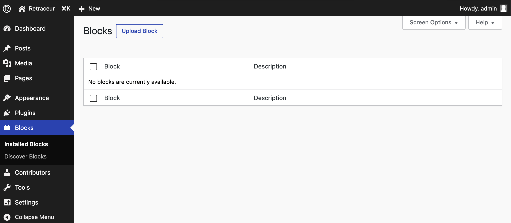
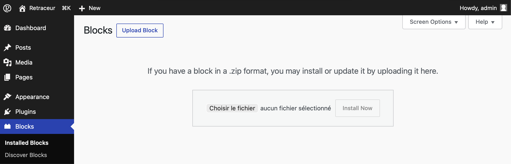
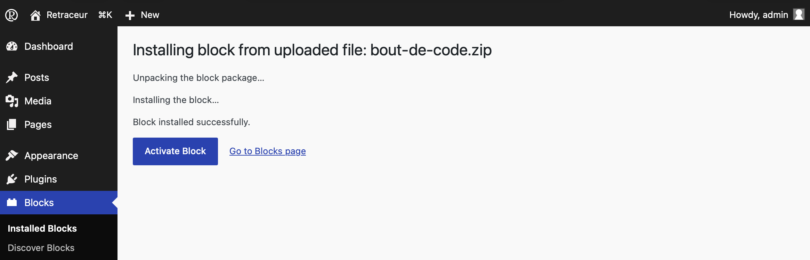
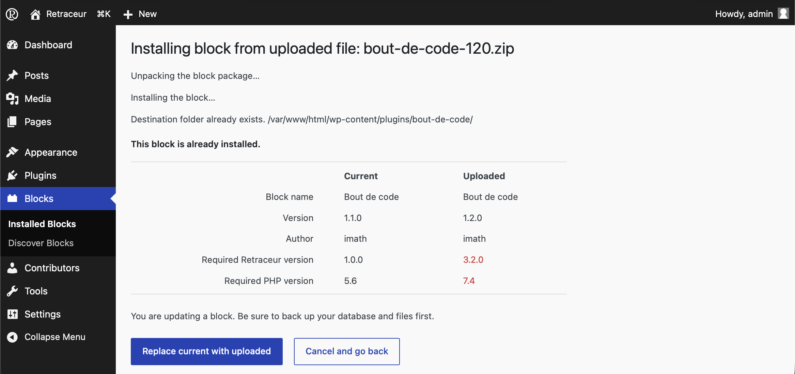

Although Blocks are packaged like Plugins, Retraceur chose to separate their administration from the Plugins one. Please note, all installed Blocks will be saved as subdirectories of the `/wp-content/plugins` directory and are managed just like plugins during the Retraceur loading process. Having a specific administration area just helps you directly and clearly figure out where you can manage the Blocks you'll manipulate from the Site Editor or the Content Editor.

## Manually installing, upgrading (or downgrading) a Block

Once you downloaded the Block's ZIP package you want to install or upgrade, you need to visit the Blocks Management area. To do so: simply click on the "Blocks" menu of your main Administration menu.

To manually add a Block's ZIP package, start by clicking on the "Upload Block" button which is located immediately at the right of the Administration page title.

Use the button to browse your computer folders to find and select the Block's ZIP package. Once done, click on the "Install" button to confirm the upload.

### Manual Installation

When the Block's directory does not yet exist on your Website, Retraceur will create a new directory for it inside your Website `/wp-content/plugins` parent directory. Then, Retraceur will tell you whether the process was successful or not.

### Manual Upgrade (or downgrade)

When the Block's directory already exists on your Website, a confirmation screen will ask you whether you want to overwrite it with the new uploaded Block.

Check the displayed information and specifically the "Version" field to make sure you're doing what you intend to do. If that's the case, click on the "Replace current with uploaded" button otherwise click on the "Cancel and go back" one. If you chose to proceed, a screen will inform you about the installation/update status. Once complete, you'll find your Block inside the list displayed into the "Installed Blocks" administration page.