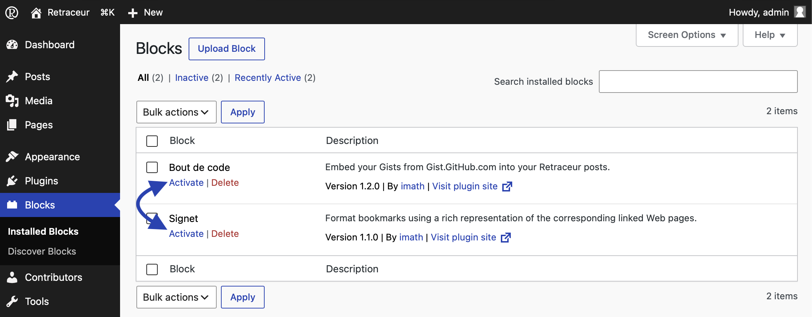
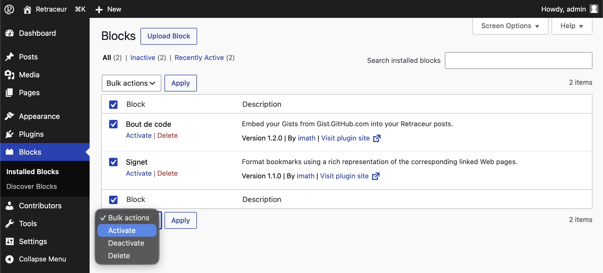
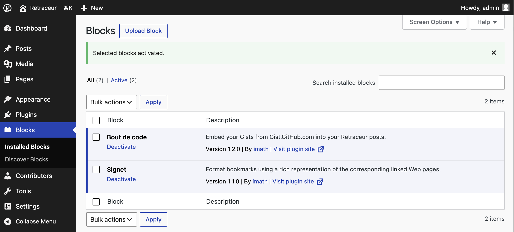
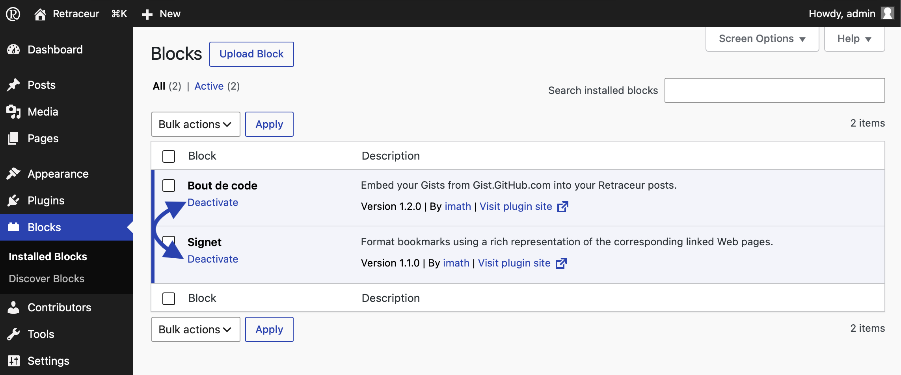
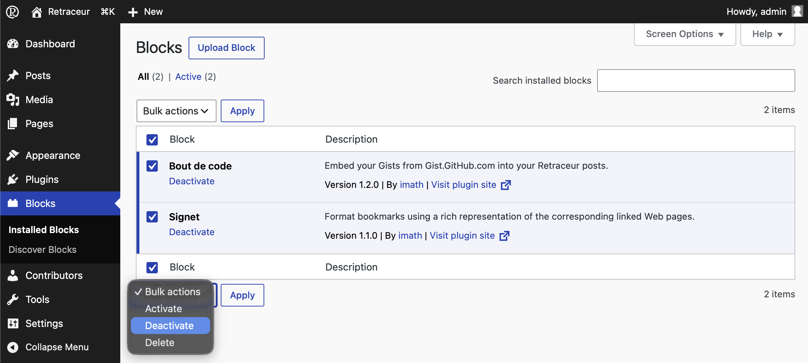
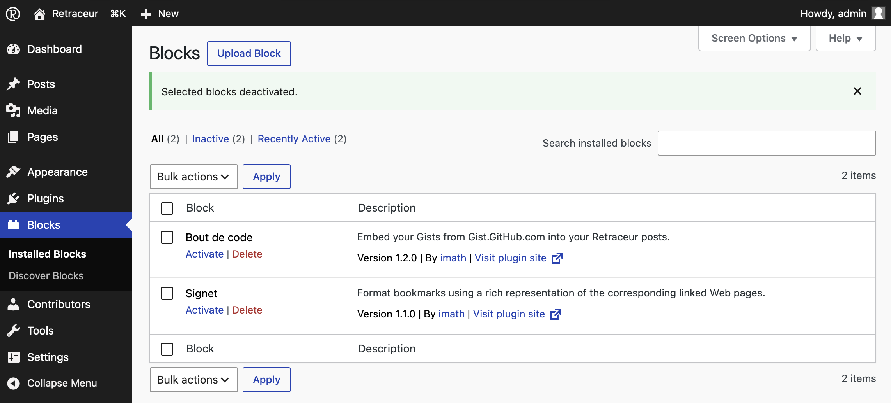
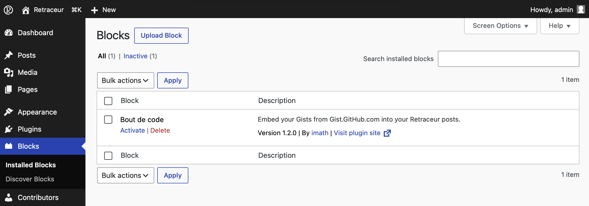
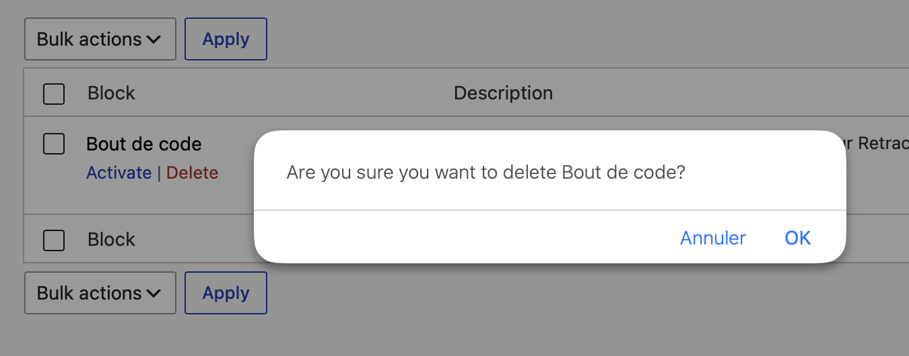
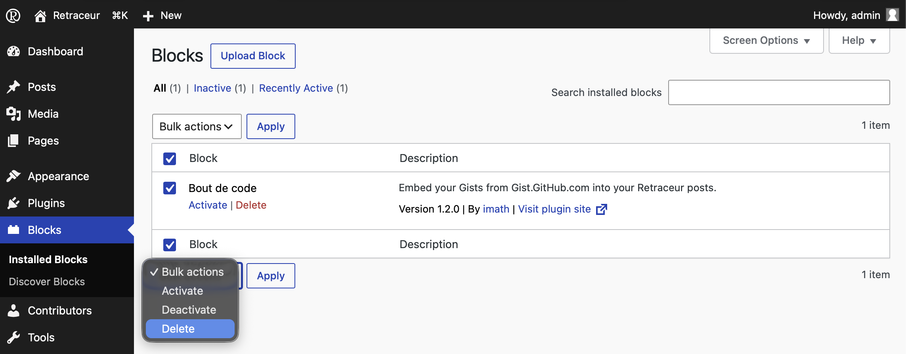
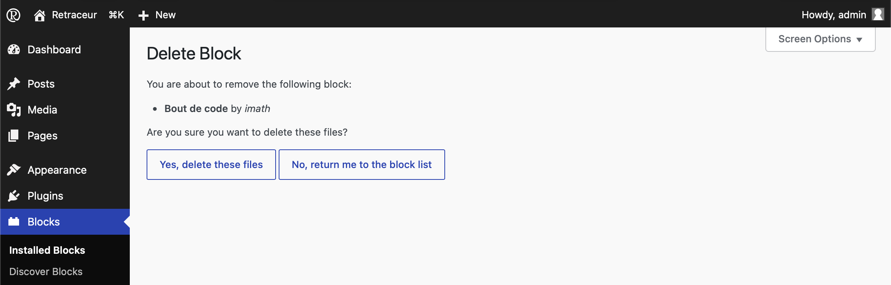

import { Aside } from '@astrojs/starlight/components';

Although Blocks are packaged like Plugins, Retraceur chose to separate their administration from the Plugins one. Please note, all installed Blocks will be saved as subdirectories of the `/wp-content/plugins` directory and are managed just like plugins during the Retraceur loading process. Having a specific administration area just helps you directly and clearly figure out where you can manage the Blocks you'll manipulate from the Site Editor or the Content Editor.

## Manually installing, upgrading (or downgrading) a Block

Once you downloaded the Block's ZIP package you want to install or upgrade, you need to visit the Blocks Management area. To do so: simply click on the "Blocks" menu of your main Administration menu.

To manually add a Block's ZIP package, start by clicking on the "Upload Block" button which is located immediately at the right of the Administration page title.

Use the button to browse your computer folders to find and select the Block's ZIP package. Once done, click on the "Install" button to confirm the upload.

### Manual Installation

When the Block's directory does not yet exist on your Website, Retraceur will create a new directory for it inside your Website `/wp-content/plugins` parent directory. Then, Retraceur will tell you whether the process was successful or not.

### Manual Upgrade (or downgrade)

When the Block's directory already exists on your Website, a confirmation screen will ask you whether you want to overwrite it with the new uploaded Block.

Check the displayed information and specifically the "Version" field to make sure you're doing what you intend to do. If that's the case, click on the "Replace current with uploaded" button otherwise click on the "Cancel and go back" one. If you chose to proceed, a screen will inform you about the installation/update status. Once complete, you'll find your Block inside the list displayed into the "Installed Blocks" administration page.

## Activating Blocks

As shown in the screenshot from the [Manual Installation](#manual-installation) subsection, the confirmation message for installing a Block includes an “Activate” link to integrate the Block into Retraceur's page-loading process for your website. You can also activate one or more Blocks in two other ways.

### Block-by-Block Activation

Below each Block's name, the first blue link activates the corresponding Block.

After clicking this link, the page will reload and confirm that the operation was successful with a message on a green background displayed above the table. Additionally, the row in the table corresponding to any activated Block will have a thicker, dark blue left border and a light blue background.

### Bulk Activation

You can also choose to activate one or more Blocks by selecting the corresponding checkboxes before using one of the two drop-down lists under “Batch Actions” to define the activation action, as shown below.

Next, click the “Apply” button to the right of the drop-down list to start the process. When the page reloads, you’ll see that the selected Block(s) have been activated, as indicated by a message with a green background positioned just above the Block table.

## Deactivating Blocks

You can deactivate one or more Blocks in two ways.

### Deactivating Blocks One by One

Below each Block’s name, the only available link lets you deactivate that Block.

After clicking this link, the page will reload and confirm that the operation was successful with a message on a green background displayed above the table. Additionally, the row in the table for any deactivated Block will not have a thicker border, and its background will be transparent.

### Batch Deactivation

You can also choose to deactivate one or more Blocks by checking the corresponding checkboxes before using one of the two drop-down lists under “Batch Actions” to select the deactivation action, as shown below.

Then click the “Apply” button just to the right of the drop-down list to start the operation. When the page reloads, you’ll see that the selected Block(s) have indeed been deactivated, as indicated by a message with a green background positioned just above the Block table.

## Uninstalling Blocks

<Aside type="note">As long as a Block is active, you cannot delete (uninstall) it. Be sure to deactivate it before uninstalling it.</Aside>

You can uninstall one or more Blocks in two ways.

### Uninstalling one block at a time

Below each Block’s name, the second red link allows you to delete the corresponding Block.

After clicking this link, a dialog box will ask you to confirm your action.

After confirmation, the row for the corresponding Block will be replaced by a message confirming that the Block has been deleted.

### Bulk Uninstallation

You can also choose to uninstall one or more Blocks by checking the corresponding checkboxes before using one of the two drop-down lists under “Bulk Actions” to select the delete action, as shown below.

Then click the “Apply” button immediately to the right of the drop-down list. An intermediate page will ask you to confirm that you want to delete the selected Block(s). Once confirmed, the Block(s) will be uninstalled.

