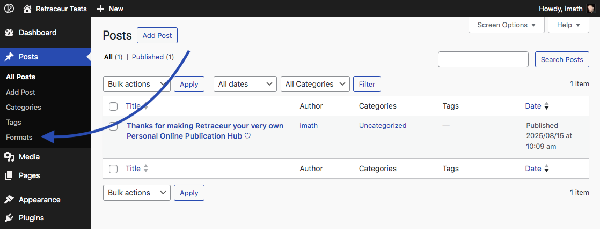
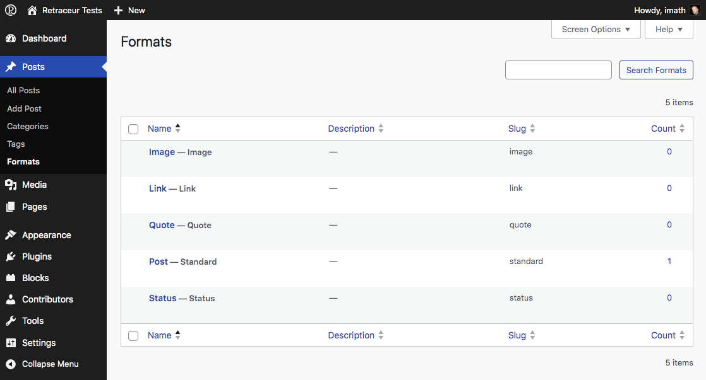
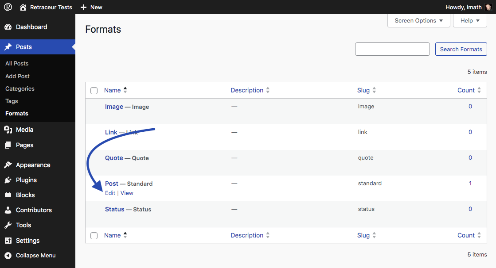
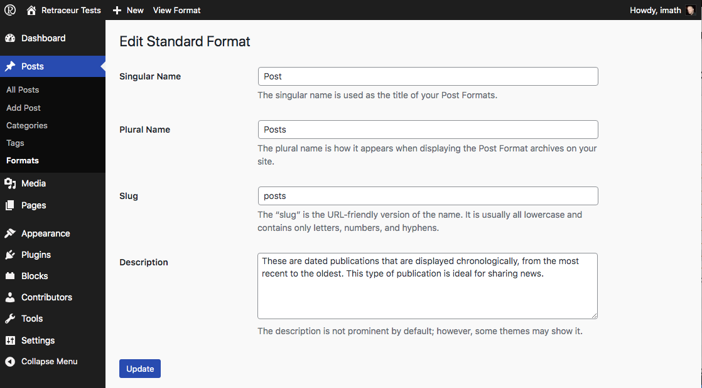
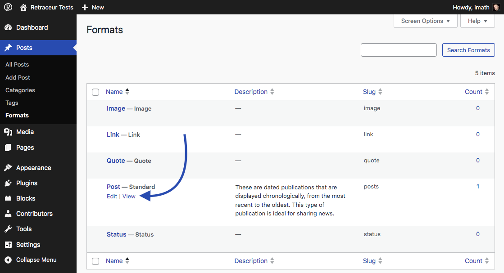
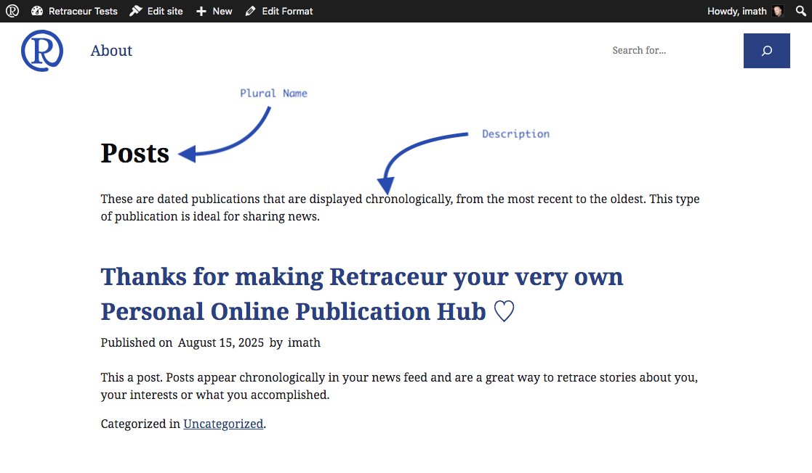

Post Formats is a feature controlled by your Retraceur active theme. The following Administration UI will only show if this theme has declared its support of the feature within their `functions.php` file. The Retraceur software offers a list of 11 Post Formats: `aside`, `audio`, `chat`, `code`, `gallery`, `image`, `link`, `quote`, `status`, `video` & `standard` (which is the default post format). A Retraceur theme can "opt-in" to support 1 or more Post Formats from its `functions.php` file. For instance the "Point" theme (which is the default Retraceur theme) supports 4 post formats: `link`, `status`, `image`, `quote` (the `standard` post format is always included as soon as a theme opted-in for the Post Formats feature). If you browse the "Point" [`functions.php` file](https://github.com/retraceur/coeur/blob/trunk/wp-content/themes/point/functions.php#L21), you'll see how this support is declared:

```php
// Use specific Post Formats.
add_theme_support( 'post-formats', array( 'link', 'status', 'image', 'quote' ) );
```

Apart from the `standard` Post Format which is the result of an elaborate writing/composing, Post Formats are straightforward contents letting authors quickly publish what comes to their mind (a bit like what they are posting on social media). Retraceur themes should adapt how these contents are specifically displayed to differentiate them from the regular Posts.

## Post Formats detailed list

- `standard`: **it's the default Post Format**. Themes are usually displaying the post title, its content and some other attributes such as its author, its publication date, etc...
- `aside`: themes should display the raw text.
- `audio`: themes should display a player to let visitors listen to the audio content.
- `chat`: themes should display a conversation transcript.
- `code`: themes should display code with syntax highlighting & line numbers.
- `gallery`: themes should display an organized list of image files.
- `image`: themes should display a single photo, painting.
- `link`: themes should display a link to another site.
- `quote`: themes should display the quotation & its author.                                  
- `status`: themes should display a status update a bit like the short messages you post on social media.
- `video`: themes should display a player to let visitors watch video content.

## Post Formats Administration screen



Inside the **Posts** Administration menu, click on the "Formats" sub-menu to head over the corresponding Administration screen.



The Post Formats Administration screen mainly displays a table containing all the formats the active theme is supporting. This table contains 4 columns:

- The "Name" column informs about the custom format name & its default name.
- The "Description" column is empty by default. The Post Format description can be used to provide information to your Website visitors about the format specificities.
- The "Slug" column informs about the part of the URL used behind `https://yoursite.url/type/` to reach the archive page of the Post Format.
- The "Count" column informs about the amount of posts using the corresponding format.

## Customizing a Post Format



Hovering the Post Format name shows a link to edit the format. You can also directly click on the Post Format name to reach the form to customize its singular & plural names, description and slug.



Once your satisfied about the new value to use for each piece of information, click on the "Update" button to save your changes.



The "View" action link that shows when you hover the Post Format name let you check how the archive page for the corresponding Post Format looks like on front-end.

