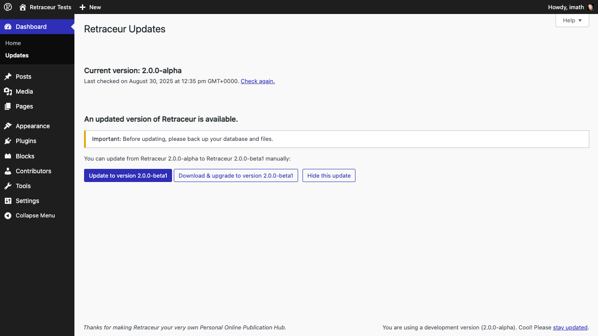
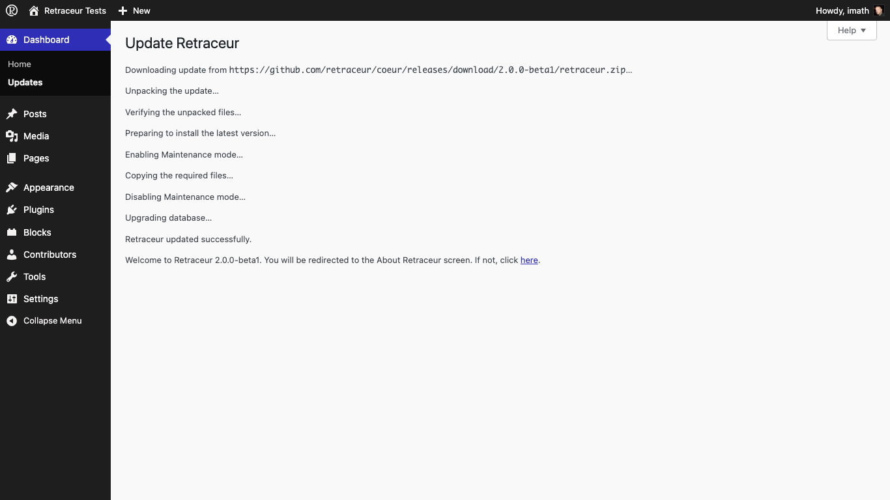

Keeping your Retraceur up to date is very important! Starting in 2.0.0, this administration screen helps you do it the best way: the one you prefer. As soon as a newer version of Retraceur is available, a new section will be added under the "Current version" one.

## The 1 click Upgrade

First of all: backup your database, the `/wp-content` directory as well as the `wp-config.php` & `.htaccess` files of your Website inside a specific folder of your local computer.

Once you've clicked on the "**Update to version X.Y.Z**" button, the administration screen is reloaded and the upgrading process starts by downloading the newer Retraceur version.

Then the newer directories and files are unpacked to a temporary folder of your Website and after checking everything is in place to safely replace all Core files (most of the `/wp-content` directory is left untouched), the process goes on until you reach the final message "Welcome to Retraceur X.Y.Z...". Shortly after, you'll be redirected to the About screen to discover what's new in Retraceur since this upgrade.

## The Manual Upgrade

If you feel safer doing the job by yourself, you can use the "**Download & upgrade to version X.Y.Z**" button to get the corresponding `retraceur.zip` archive containing all the files you'll need to perform your manual upgrade. Please visit [this guide](./../../getting-started/upgrade) for the complete steps list.

## Skipping an update

All Retraceur newer versions will be listed into this screen: major ones, minor ones as well as beta/RC ones. You can **hide** an update clicking on the corresponding button. For example, if you're on a production site, you'll probably won't take the risk to test beta versions!