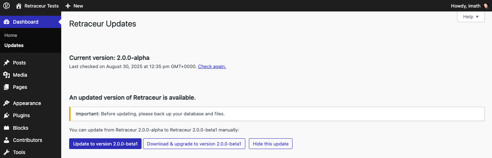
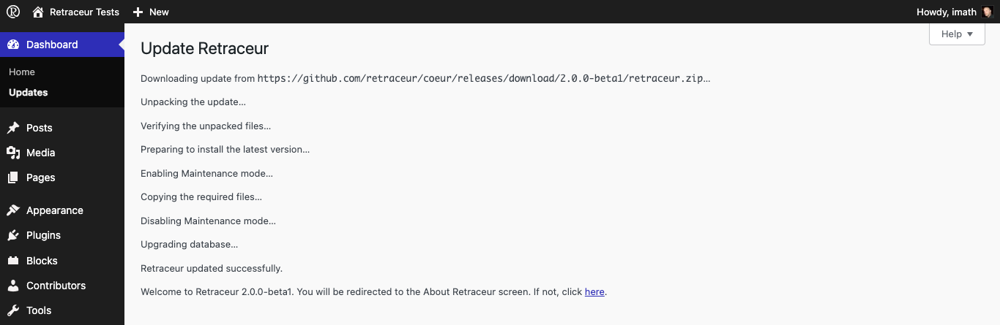
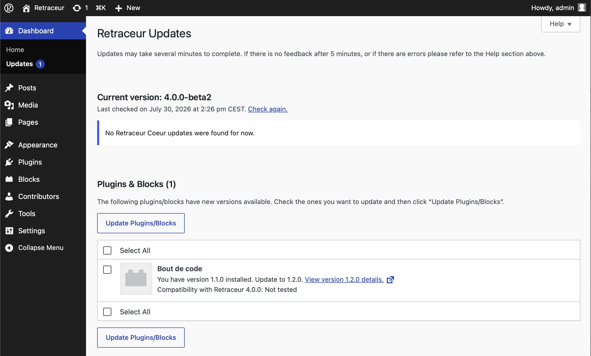
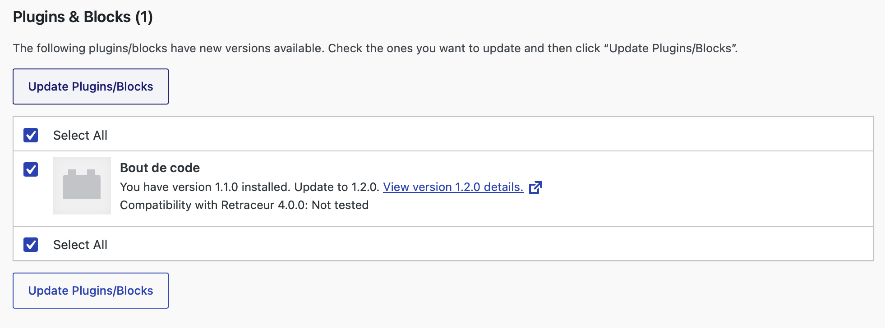
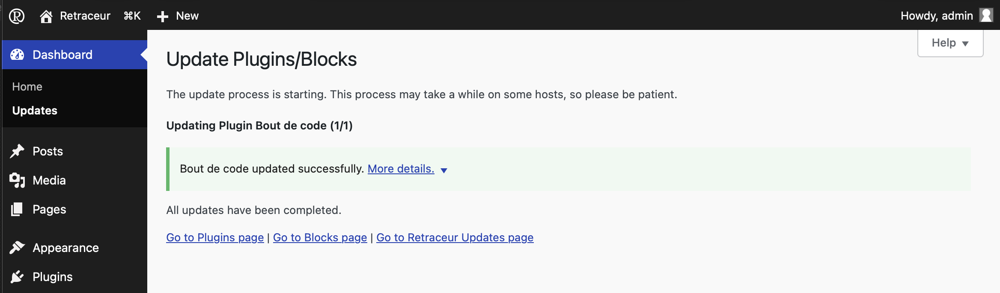

Keeping the Retraceur cœur up to date is very important! Starting in 2.0.0, the first part of this administration screen helps you do it the best way: the one you prefer. As soon as a newer version of Retraceur is available, a new section will be added under the "Current version" one so that you can manage this update.

Retraceur 4.0.0 added Plugins & Blocks update management to the second part of this Administration screen, making it the central & unique place to update your Website. 

## Core Updates

To reach the Updates screen, you simply need to hover the very first Dashboard Admin menu to discover the Updates submenu. Click on it to open the corresponding Administration page.

### The 1 click Update

First of all: backup your database, the `/wp-content` directory as well as the `wp-config.php` & `.htaccess` files of your Website inside a specific folder of your local computer.

Once you've clicked on the "**Update to version X.Y.Z**" button, the administration screen is reloaded and the upgrading process starts by downloading the newer Retraceur version.

Then the newer directories and files are unpacked to a temporary folder of your Website and after checking everything is in place to safely replace all Core files (most of the `/wp-content` directory is left untouched), the process goes on until you've reached the final message "Welcome to Retraceur X.Y.Z...". Shortly after, you'll be redirected to the About screen to discover what's new in Retraceur since this update.

### The Manual Update

If you feel safer doing the job by yourself, you can use the "**Download & update to version X.Y.Z**" button to get the corresponding `retraceur.zip` archive containing all the files you'll need to perform your manual update. Please visit [this guide](./../../getting-started/upgrade) for the complete manual update steps list.

### Skipping an Update

All Retraceur newer versions will be listed into this screen: major ones, minor ones as well as beta/RC ones. You can **hide** an update by clicking on the corresponding button. For example, if you're on a production site, you'll probably won't take the risk to test beta versions!

## Plugin & Block Updates

Updating Plugins & Blocks happens from the same Updates screen, you'll find below the Retraceur Core updates section the one dedicated to Plugins & Blocks.

Use the checkboxes to select the Blocks and/or Plugins you wish to update, then click on one of the Update Plugins/Blocks button to start the process.

Retraceur will launch the ZIP archive download(s) before installing it. If everything went great, a green box will be displayed to confirm it.

