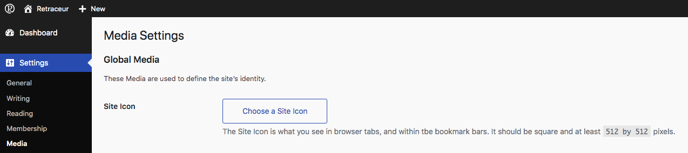
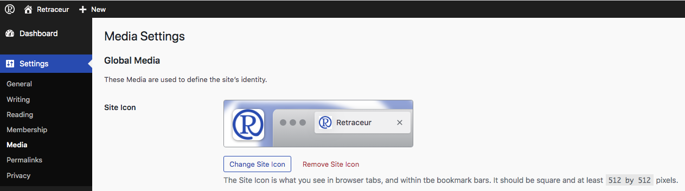
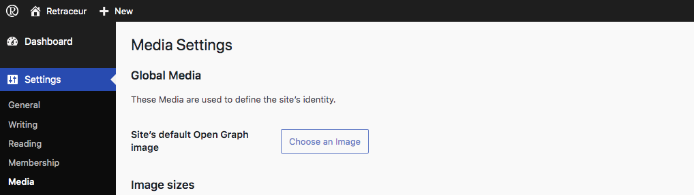
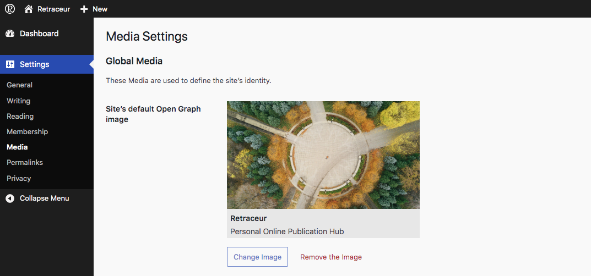
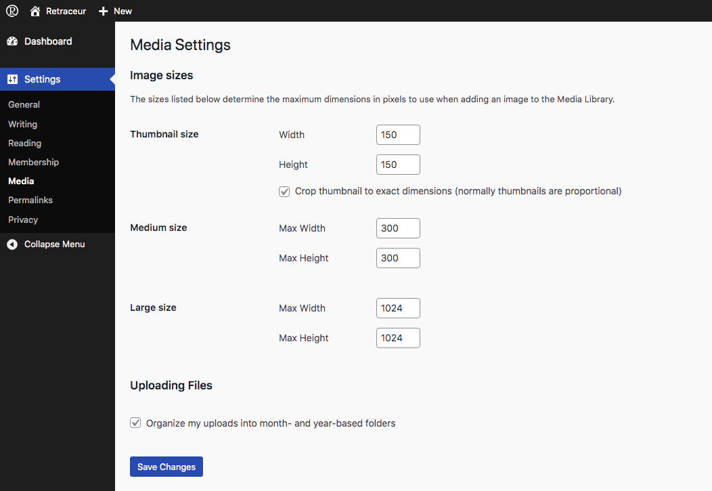

The **Settings → Media** screen allows you to define global parameters related to how images are used in Retraceur. These settings include: the site icon, the default Open Graph image, the image sizes generated when uploading a file. These parameters apply to the entire site.

## Site Icon

The site icon is the image used to represent your site in various contexts, including:

- browser tabs;
- bookmarks;
- shortcuts on a device’s home screen.

This icon is sometimes referred to as a favicon.

### Setting the site icon

To set a site icon:

1. click Choose Image;
2. select an image from the media library or upload a new one;
3. don't forget to save the changes using the "Save changes" blue button at the bottom of the Media Settings screen.

It is recommended to use a square image of at least 512 × 512 pixels. Retraceur automatically generates the variants required by browsers and devices.

Once saved, you can always change or remove the Site Icon using the corresponding buttons.

## Default Open Graph Image

Retraceur includes an Open Graph API that controls the information used when sharing a page. The Open Graph image defined here is used when no specific image is defined for a piece of content. This ensures that links shared from your site always have an illustration.

### Setting the default image

To define the default Open Graph image, it's very similar to the way you set a Site Icon:

1. click Choose Image;
2. select an image from the media library or upload a new one;
3. don't forget to save the changes using the "Save changes" blue button at the bottom of the Media Settings screen.

For optimal display on most platforms, it is recommended to use an image around 1200 × 630 pixels.

Once saved, you can always change or remove the default Open Graph Image using the corresponding buttons.

## Image Sizes

When an image is uploaded to the media library, Retraceur automatically generates several sizes. These sizes may be used by themes, blocks, or interface features.

The fields in this section allow you to define:

- the maximum width;
- the maximum height;
- the cropping behavior.

Changes made to these settings only affect images uploaded after the settings are saved.