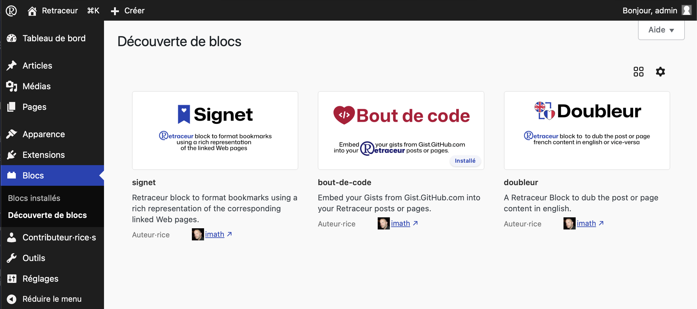
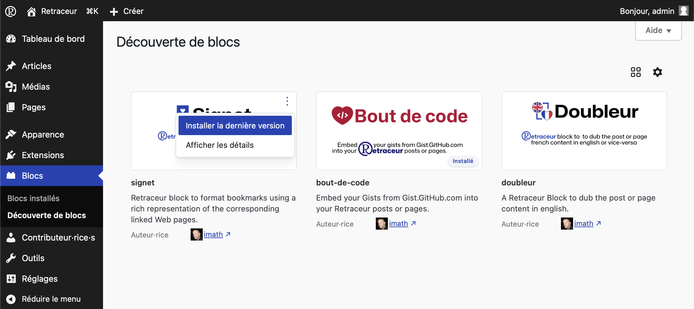
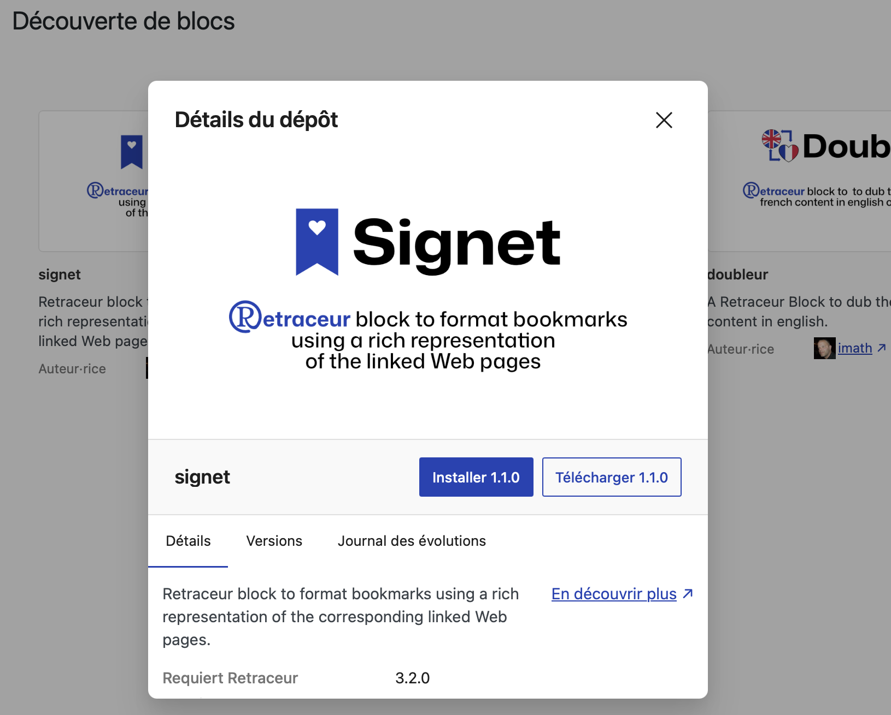
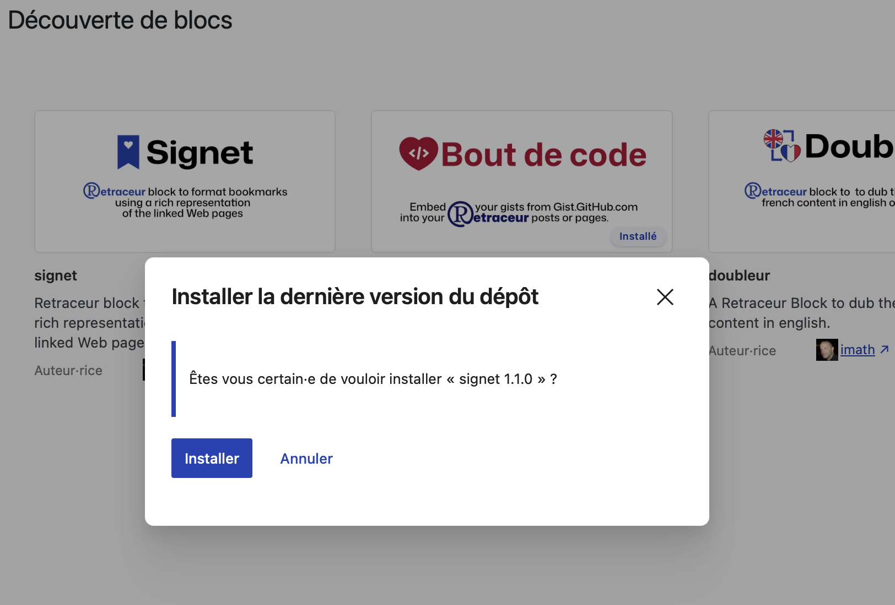
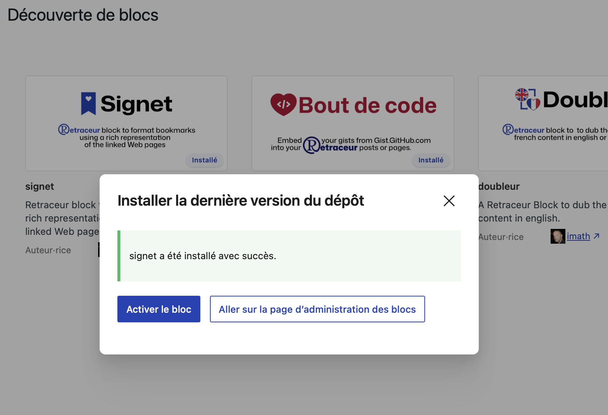

import { Aside } from '@astrojs/starlight/components';

Dans la zone d’administration des blocs, le sous-menu «&nbsp;Découverte des blocs&nbsp;» vous propose de parcourir directement depuis Retraceur les blocs partagés via [GitHub](https://github.com/topics/retraceur-block) par des développeur·euse·s ayant décidé, comme vous, d’utiliser Retraceur.

## Une Exploration nécessairement vigilante

<Aside type="caution" title="Prudence">L’intégration des informations relatives à ces blocs dans votre Administration ne fait pas l’objet d’une modération ou de vérifications régulières de la sécurité du code utilisé par les développeur·euse·s. Retraceur ne fait que faciliter un accès à des ressources que vous trouveriez directement sur le site de [GitHub](https://github.com/topics/retraceur-block). Prenez donc le temps de bien consulter toutes les informations fournies dans le détail du block (ex: version de Retraceur requise, nombre d’anomalies ouvertes, d'étoiles, etc...).</Aside>

Voici l'interface dynamique que vous pourrez consulter en accédant à la page de découverte de blocs Retraceur.

Chaque bloc listé informe sur son nom, sa description et son auteur·rice. Cette dernière infomation intègre un lien pour pouvoir en savoir plus sur lui·elle.

En survolant le coin droit de chacune des images représentants les blocs, un bouton pour en afficher davantage (trois petits points verticaux) apparaît et vous propose d'installer directement le bloc ou de lire plus de détails à son sujet. 

<Aside type="caution" title="Recommandation">Il est fortement recommandé de systématiquement consulter le détail d'un bloc avant de lancer son installation.</Aside>

### Détails d’un bloc

Le premier onglet «&nbsp;Détails&nbsp;» vous presente à nouveau la description du bloc mais aussi des informations importantes :

- La version de Retraceur requise pour exécuter ce bloc,
- La version de PHP requise pour exécuter ce bloc,
- La date de sa dernière mise à jour,
- Le nombre d'étoiles obtenues par le bloc,
- Le nombre d'anomalies actuellement ouvertes (non résolues).

Par ailleurs, le lien «&nbsp;En découvrir plus&nbsp;» vous permet d'ouvrir une nouvelle fenêtre sur la page GitHub du bloc afin d'éventuellement rapporter une anomalie.

### Versions et journal des évolutions

Ces deux onglets contribuent à vous renseigner sur la maturité et la régularité de la maintenance du bloc.

<Aside type="tip">En cliquant sur l'image représentant le bloc ou sur son titre, vous accédez aussi aux informations de détail du bloc.</Aside>

## Installation d'un bloc

Comme le montre les deux captures d'écran précédentes, vous pouvez initier le processus d'installation d'un bloc en utilisant l'action d'installation du bouton pour en afficher davantage ou sur le bouton «&nbsp;Installer X.Y.Z&nbsp;» (où X.Y.Z est le numéro de version du bloc) de la fenêtre modale de détail. Dès que vous avez cliqué sur l'un de ces deux boutons, une nouvelle fenêtre modale apparaîtra pour vous demander de confirmer votre souhait d'installation du bloc.

En cliquant sur le bouton «&nbsp;Installer&nbsp;», l'installation est lancée et après quelques secondes de patience cette fenêtre se met à jour pour vous indiquer le résultat de cette opération.

À partir du moment où tout se passe bien, vous serez invité soit à activer le bloc, soit à afficher la [page de gestion des blocs](../../administration/manage-blocks).

## Contacts de Support d'un bloc

<Aside type="danger" icon="github" title="Support">En cas de difficulté avec un des blocs, vos interlocuteur·rice·s sont les développeur·euse·s qui les ont élaborés et [auto-référencés](../../plugins/publish) comme étant compatibles avec Retraceur. Contactez les directement via l’URL de leur dépôt GitHub en leur rapportant le problème rencontré via la publication d’une «&nbsp;issue&nbsp;».</Aside>