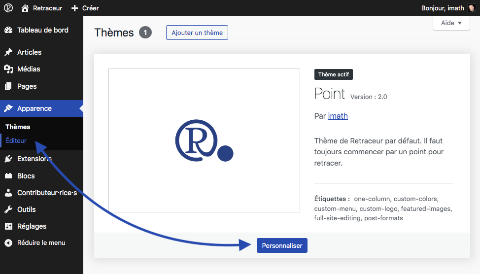
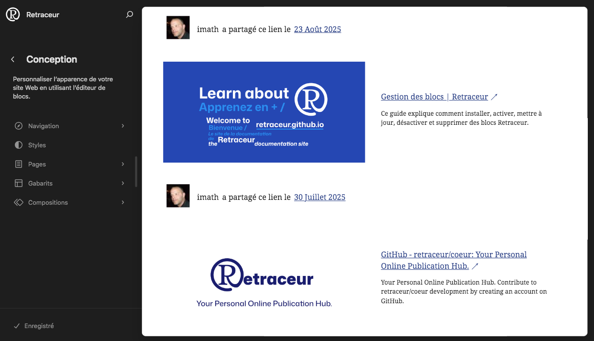

L'éditeur de site vous permet d'ajuster l'apparence de l'ensemble du site, y compris l'en-tête, le pied de page et tout le reste, grâce aux blocs. Il vous offre un contrôle total sur l'atmosphère de votre site.

## Ouvrir l'Éditeur de Site

Pour lancer l'Éditeur de Site, vous pouvez alternativement :

- Cliquer sur le sous-menu « Éditeur » du menu « Apparence » de votre tableau de bord.
- Cliquer sur le bouton « Personnaliser » qui s'affiche dans le cadre du thème activé de la liste des thèmes installés.

## Manager la navigation principale de votre site

À compléter

## Manager les styles de votre site

À compléter

## Personnaliser les gabarits de votre site

À compléter

## Modifier les compositions de votre site

À compléter