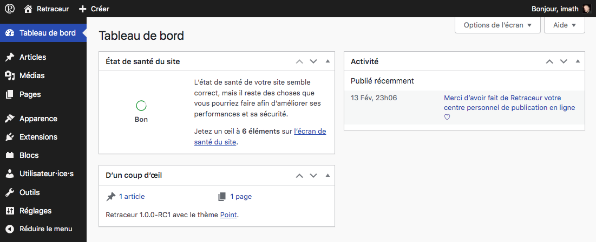

Comme illustré ci-dessus, le menu d'administration principal se situe dans la colonne de gauche (celle qui présente un arrière plan noir). Chaque élément de ce menu est décrit ci-dessous.

## Page d'accueil du tableau de bord

Par défaut, cette page affiche 3 "widgets" de tableau de bord :

- Le widget d'**État de santé du site** vous fournit une vue d'ensemble de l'état actuel de votre site Web et vous informe si toutefois certaines parties de ce dernier nécessitent des améliorations. Ce widget intègre un raccourci pour atteindre la page d'administration de la santé de votre site Web, laquelle est également accessible comme sous-page de l'adminitration des outils du site.
- Le widget **d'un coup d'œil** présente un résumé du contenu de votre site Web, le thème en cours d'utilisation ainsi que la version de Retraceur que vous utilisez.
- Le widget d'**Activité** affiche les prochains articles prévus tout comme ceux qui ont été publiés récemment.

## Administration des articles

À compléter

## Administration des médias

À compléter

## Administration des pages

À compléter

## Gestion de l'apparence

À compléter

## Gestion des extensions

À compléter

## Gestions des blocs

À compléter

## Gestions des utilisateur·ice·s

À compléter

## Outils d'administration

À compléter

## Gestion des réglages

À compléter