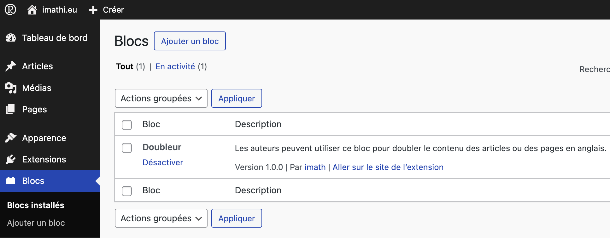
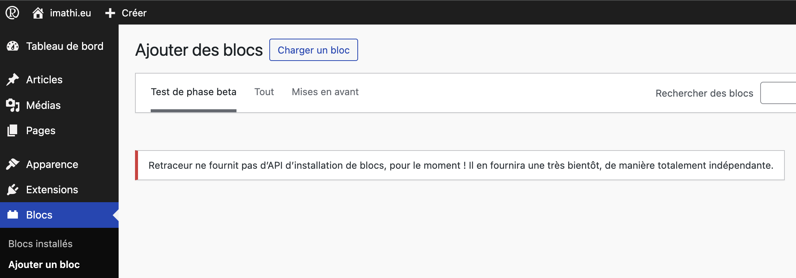
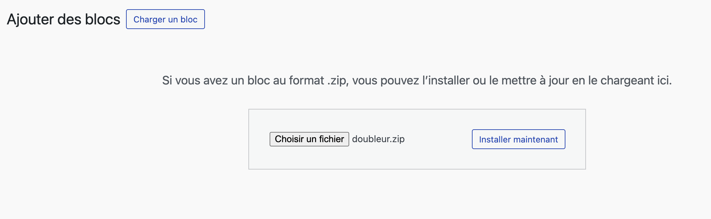
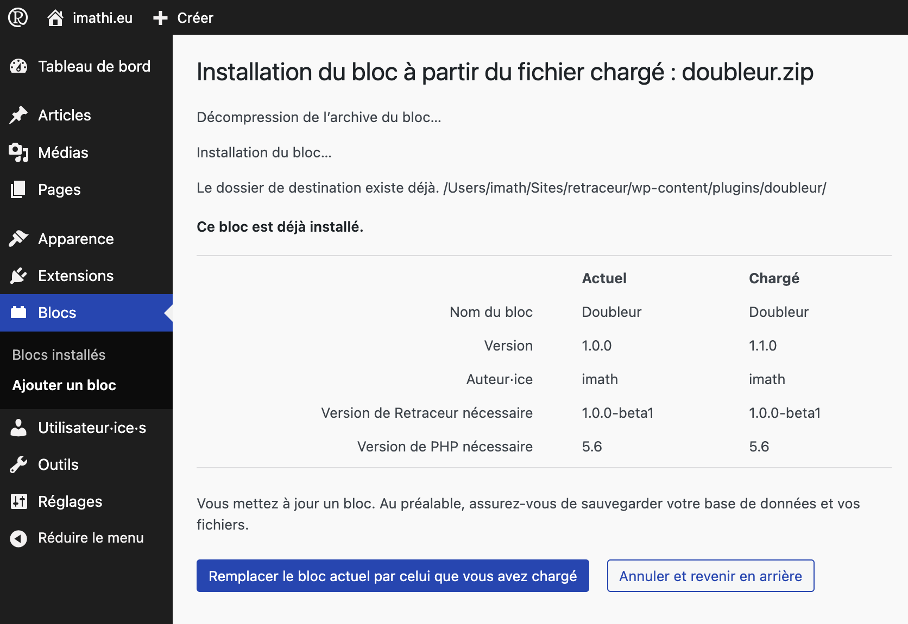

Bien que les blocs soient emballés comme des extensions, Retraceur a choisi de séparer leur administration de celle des extensions. Merci de noter que tous les blocs installés seront enregistrés dans des sous-répertoires du répertoire `/wp-content/plugins` et sont gérés comme des extensions pendant le processus de chargement de Retraceur. Avoir une zone d'administration spécifique vous aide simplement à directement trouver ou clairement identifier où vous pouvez gérer les blocs que vous manipulerez depuis l'éditeur de site ou l'éditeur de contenu.

## Installation ou mise à jour d'un bloc

Une fois que vous avez téléchargé l'archive ZIP du bloc que vous souhaitez installer ou mettre à niveau, vous devez vous rendre dans la zone de gestion des blocs. Pour ce faire : cliquez simplement sur le menu « Blocs » de votre menu d'administration principal.

Une fois que c'est fait, vous pouvez soit cliquer sur le sous-menu « Ajouter un bloc » dans votre menu d'administration principal, soit cliquer sur le bouton situé immédiatement à droite du titre de la page d'administration et ayant le même texte que le sous-menu des Blocs de votre menu d'administration principal.

Comme Retraceur ne fournit pas encore d'intégration avec des répertoires de bloc distants, vous ne pouvez qu'ajouter manuellement une archive ZIP du bloc que vous avez trouvé sur Internet (par exemple sur [GitHub.com](https://github.com/topics/retraceur-block)). Pour charger manuellement l'archive ZIP d'un bloc, commencez par cliquer sur le bouton « Charger un bloc » qui se trouve immédiatement à droite du titre de la page d'administration.

Utilisez alors le bouton vous permettant de parcourir les dossiers de votre ordinateur afin de trouver et sélectionner l'archive ZIP du bloc que vous avez téléchargé sur Internet. Une fois cette étape accomplie, cliquez sur le bouton « Installer » pour confirmer le chargement et créer un nouveau répertoire pour votre bloc dans le répertoire parent `/wp-content/plugins` de votre site Web.

Cette étape n'intervient que si vous mettez à niveau ou revenez à une précédente version d'un bloc préexistant. Vérifiez les informations affichées et en particulier le champ « Version » pour vous assurer que vous faites bien ce que vous avez l'intention de faire. Si c'est le cas, cliquez sur le bouton « Remplacer le bloc actuel par celui que vous avez chargé » sinon cliquez sur le bouton « Annuler et revenir en arrière ». Si vous choisissez de continuer votre opération, un écran vous informera de l'état d'installation/de mise à jour de votre bloc. Une fois le processus terminé, vous retrouverez votre bloc dans la liste affichée dans la page d'administration des « Blocs installés ».