import { Aside } from '@astrojs/starlight/components';

Bien que les blocs soient empaquetés comme des extensions, Retraceur a choisi de séparer leur administration de celle des extensions. Merci de noter que tous les blocs installés seront enregistrés dans des sous-répertoires du répertoire `/wp-content/plugins` et sont gérés comme des extensions pendant le processus de chargement de Retraceur. Avoir une zone d'administration spécifique vous aide simplement à directement trouver ou clairement identifier où vous pouvez gérer les blocs que vous manipulerez depuis l'éditeur de site ou l'éditeur de contenu.

## Installation ou mise à niveau manuelles d'un bloc

Une fois que vous avez téléchargé l'archive ZIP du bloc que vous souhaitez installer ou mettre à niveau, vous devez vous rendre dans la zone de gestion des blocs. Pour ce faire : cliquez simplement sur le menu « Blocs » de votre menu d'administration principal.

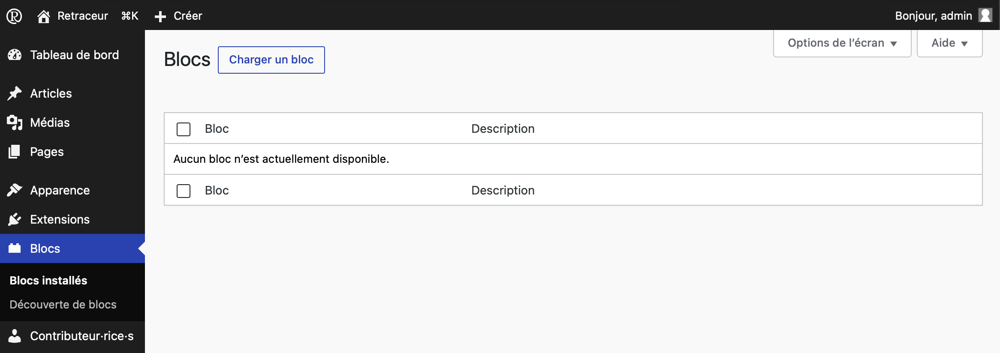

Pour charger manuellement l'archive ZIP d'un bloc, commencez par cliquer sur le bouton « Charger un bloc » qui se trouve immédiatement à droite du titre de la page d'administration.

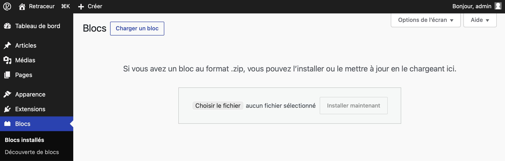

Utilisez alors le bouton vous permettant de parcourir les dossiers de votre ordinateur afin de trouver et sélectionner l'archive ZIP du bloc. Une fois cette étape accomplie, cliquez sur le bouton « Installer » pour confirmer le chargement.

### Installation manuelle

Lorsque le répertoire du bloc n’existe pas encore sur votre site, Retraceur créera un nouveau répertoire pour votre bloc dans le répertoire parent `/wp-content/plugins` de votre site Web. Ensuite, Retraceur vous informera du succès ou de l'échec du processus.

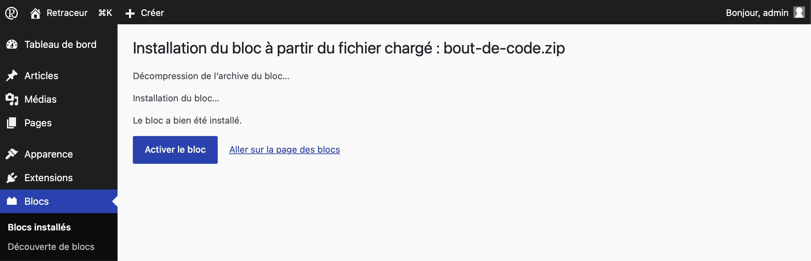

### Mise à niveau manuelle

Lorsque le répertoire du bloc existe déjà sur votre site, un écran de confirmation vous demandera si vous souhaitez « écraser » ce dernier avec celui du bloc nouvellement chargé.

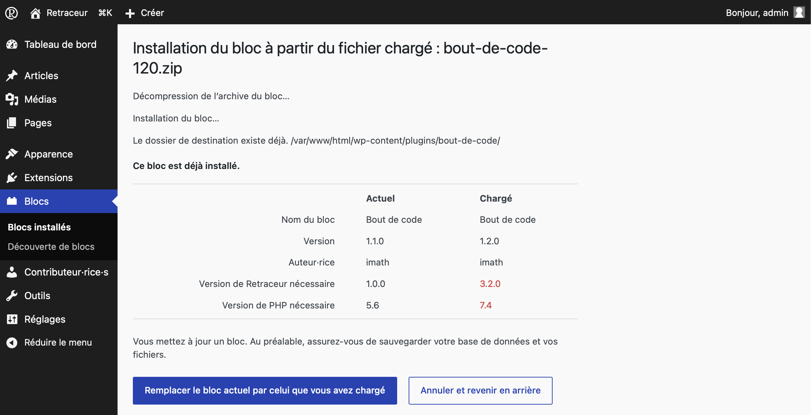

Vérifiez les informations affichées et en particulier le champ « Version » pour vous assurer que vous faites bien ce que vous avez l'intention de faire. Si c'est le cas, cliquez sur le bouton « Remplacer le bloc actuel par celui que vous avez chargé » sinon cliquez sur le bouton « Annuler et revenir en arrière ». Si vous choisissez de continuer votre opération, un écran vous informera de l'état d'installation/de mise à jour de votre bloc. Une fois le processus terminé, vous retrouverez votre bloc dans la liste affichée dans la page d'administration des « Blocs installés ».

## Activation des blocs

Comme le montre la capture d'écran du sous chapitre [Installation manuelle](#installation-manuelle), le message de confirmation de l'installation d'un bloc comporte un lien "Activer" afin d'intégrer le bloc au processus de chargement d'une page de votre site Web par Retraceur. Vous pouvez également activer un ou plusieurs blocs de deux autres façons.

### Activation bloc par bloc

Sous le nom de chaque bloc, le premier lien de couleur bleu permet d'activer le bloc correspondant.

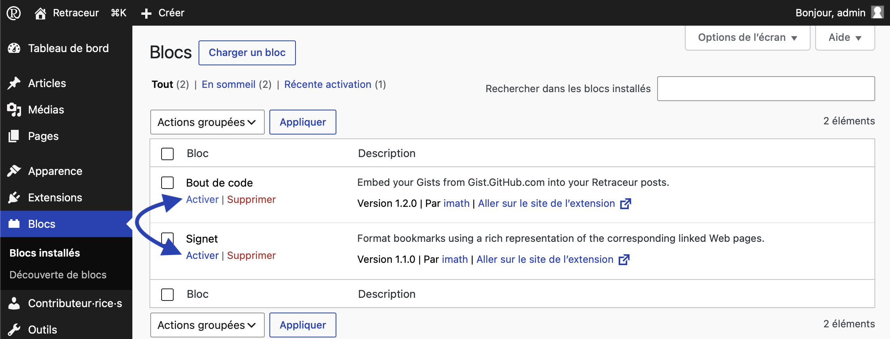

Après avoir cliqué sur ce lien, la page se recharge et vous confirmera la réussite de l'opération à l'aide d'un message sur fond vert positionné au-dessus du tableau. Par ailleurs, la rangée du tableau de tout bloc activé présente une bordure gauche bleue foncée et plus épaisse et son arrière plan est colorée en bleu clair.

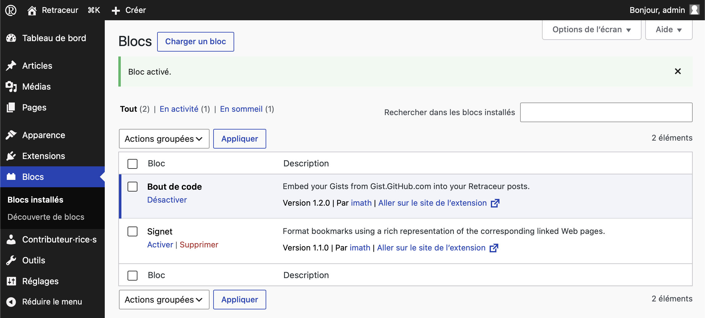

### Activation groupée

Vous pouvez également choisir d'activer un ou plusieurs blocs en cochant les cases à cocher correspondantes avant d'utiliser une des deux listes déroulantes des «&nbsp;Actions groupées&nbsp;» pour définir l'action d'activation comme illustré ci-dessous.

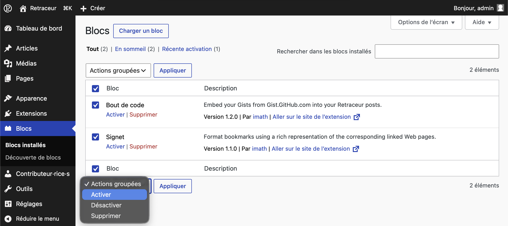

Cliquer ensuite sur le bouton «&nbsp;Appliquer&nbsp;» juste à droite de la liste déroulante pour lancer l'opération et découvrir au rechargement de la page que le ou les blocs sélectionnés ont effectivement été activés dans un message ayant un arrière plan vert positionné juste au-dessus du tableau des blocs.

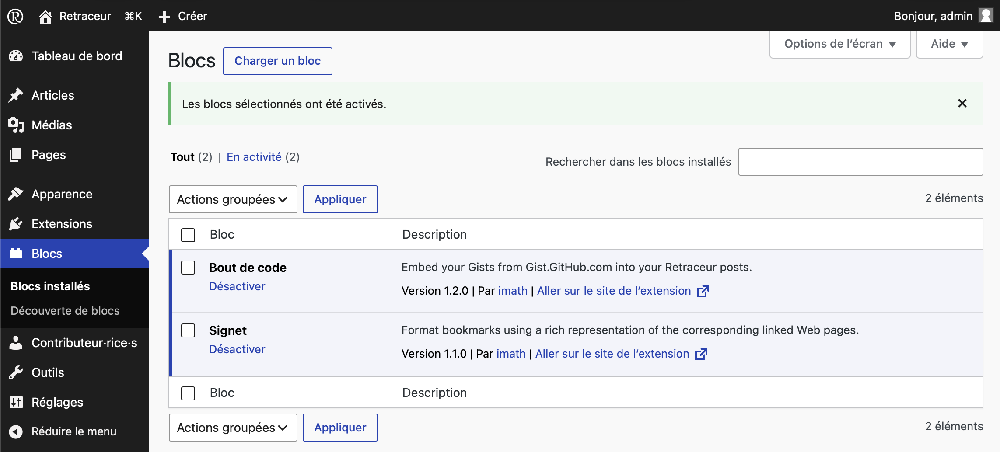

## Désactivation des blocs

Vous pouvez désactiver un ou plusieurs blocs de deux façons.

### Désactivation bloc par bloc

Sous le nom de chaque bloc, le seul lien disponible permet de désactiver le bloc correspondant.

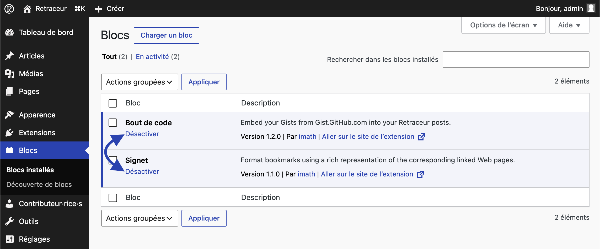

Après avoir cliqué sur ce lien, la page se recharge et vous confirmera la réussite de l'opération à l'aide d'un message ayant un arrière plan vert positionné au-dessus du tableau. Par ailleurs, la rangée du tableau de tout bloc désactivé ne présentera pas de bordure plus épaisse et son arrière plan sera transparent.

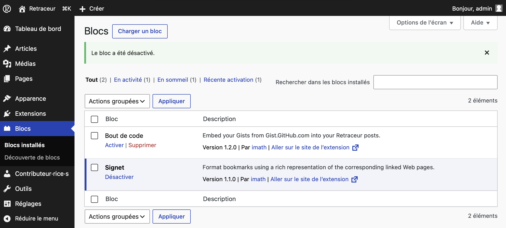

### Désactivation groupée

Vous pouvez également choisir de désactiver un ou plusieurs blocs en cochant les cases à cocher correspondantes avant d'utiliser une des deux listes déroulantes des «&nbsp;Actions groupées&nbsp;» pour définir l'action de désactivation comme illustré ci-dessous.

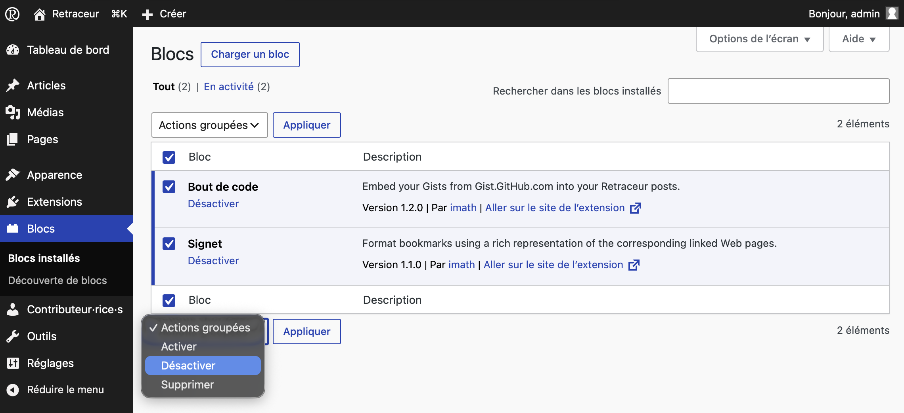

Cliquer ensuite sur le bouton «&nbsp;Appliquer&nbsp;» juste à droite de la liste déroulante pour lancer l'opération et découvrir au rechargement de la page que le ou les blocs sélectionnés ont effectivement été désactivés dans un message ayant un arrière plan vert positionné juste au-dessus du tableau des blocs.

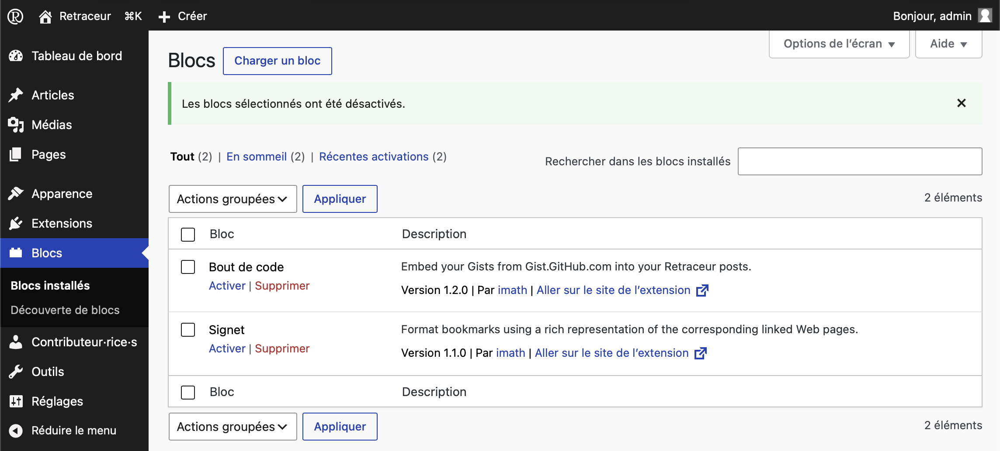

## Désinstallation des blocs

<Aside type="note">Tant qu'un bloc est actif, il n'est pas possible de le supprimer (désinstaller). Il s'agit de s'assurer de le désactiver avant sa désinstallation.</Aside>

Vous pouvez désinstaller un ou plusieurs blocs de deux façons.

### Désinstallation bloc par bloc

Sous le nom de chaque bloc, le deuxième lien de couleur rouge vous permet de supprimer le bloc correspondant.

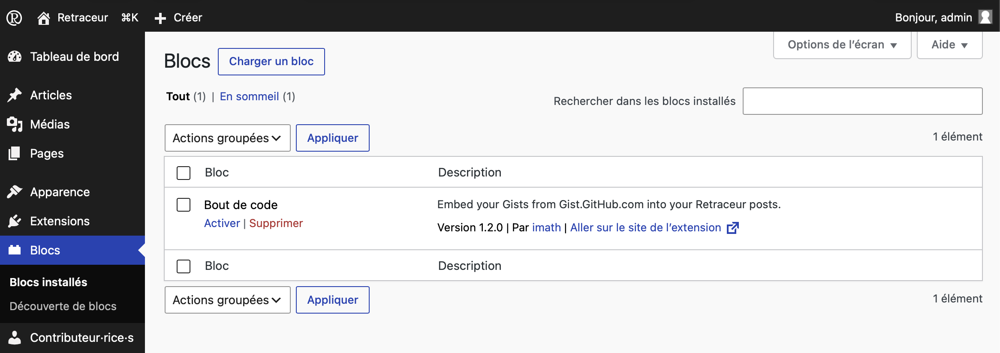

Après avoir cliqué sur ce lien, une fenêtre de dialogue vous demandera de confirmer votre action.

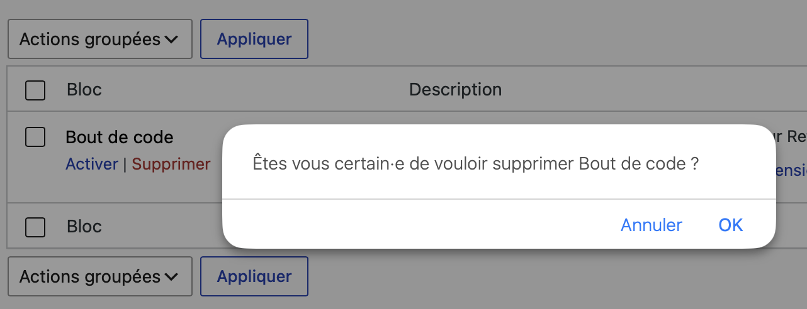

Après confirmation, la rangée du bloc corresponsant sera remplacée par un message vous confirmant la suppression du bloc.

### Désinstallation groupée

Vous pouvez également choisir de désinstaller un ou plusieurs blocs en cochant les cases à cocher correspondantes avant d'utiliser une des deux listes déroulantes des «&nbsp;Actions groupées&nbsp;» pour définir l'action de suppression comme illustré ci-dessous.

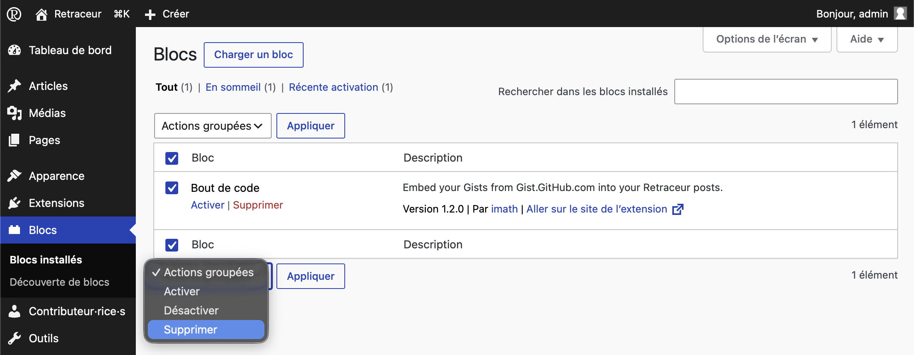

Cliquer ensuite sur le bouton «&nbsp;Appliquer&nbsp;» juste à droite de la liste déroulante. Une page intermédiaire vous demandera de confirmer votre souhait de supprimer le ou les blocs sélectionnés. Une fois confirmé, le ou les blocs seront effectivement désinstallés.

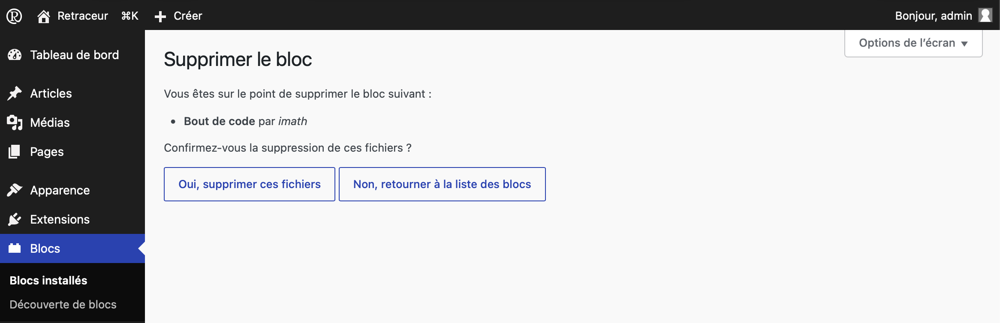