import { Aside } from '@astrojs/starlight/components';

Vous accédez à l'interface de management des extensions à partir du menu d'administration du même nom. Ce management comprend l'ajout ou la mise à jour manuel, l'activation, la désactivation et la désinstallation.

## Installation ou mise à niveau manuelles d'une extension

Pour charger manuellement l'archive ZIP d'une extension, commencez par cliquer sur le bouton «&nbsp;Charger une extension&nbsp;» qui se trouve immédiatement à droite du titre de la page d'administration.

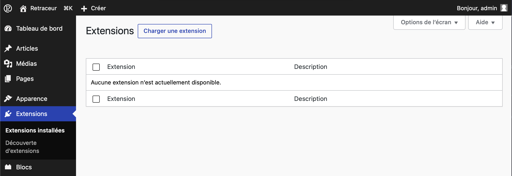

Utilisez alors le bouton vous permettant de parcourir les dossiers de votre ordinateur afin de trouver et sélectionner l'archive ZIP de l'extension. Une fois cette étape accomplie, cliquez sur le bouton «&nbsp;Installer&nbsp;» pour confirmer le chargement.

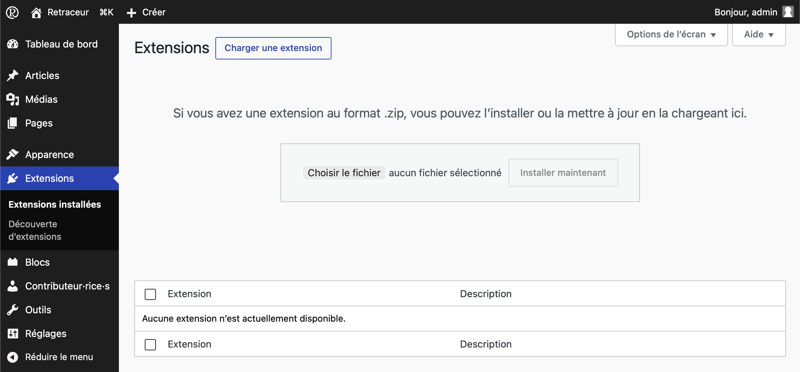

### Installation manuelle

Lorsque le répertoire d'une extension n’existe pas encore sur votre site, Retraceur créera un nouveau répertoire pour celle-ci dans le répertoire parent `/wp-content/plugins` de votre site Web pour y déverser le contenu de l'archive ZIP. Ensuite, Retraceur vous informera du succès ou de l'échec de l'opération.

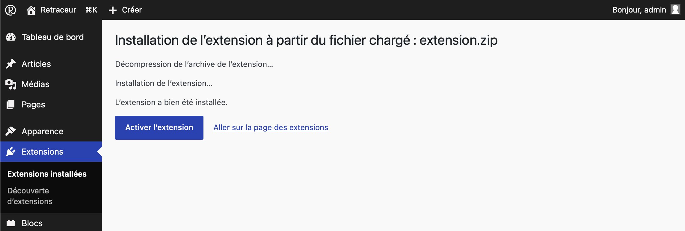

### Mise à niveau manuelle

Lorsque le répertoire de l'extension existe déjà sur votre site, un écran de confirmation vous demandera si vous souhaitez « écraser » ce dernier avec celui de l'extension nouvellement chargée.

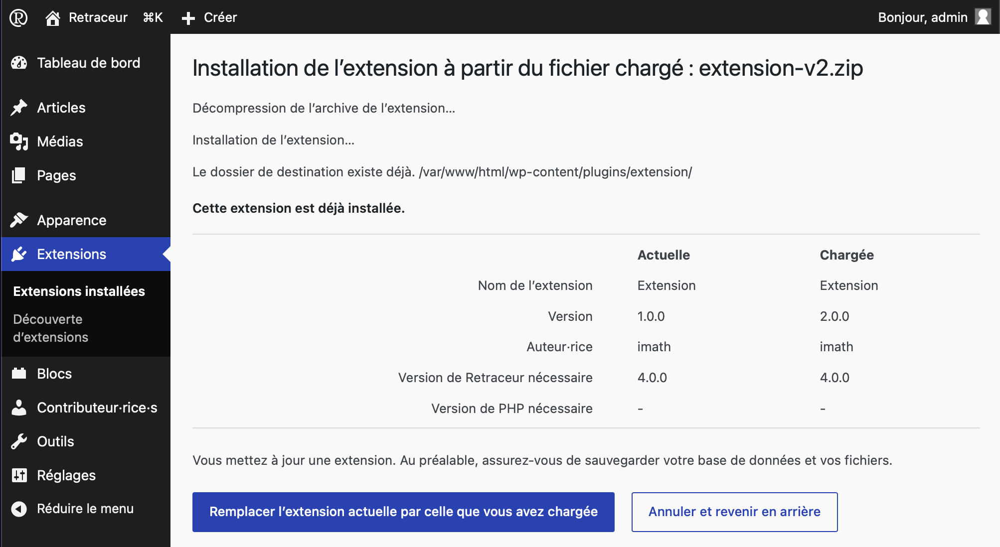

Vérifiez les informations affichées et en particulier le champ « Version » pour vous assurer que vous faites bien ce que vous avez l'intention de faire. Si c'est le cas, cliquez sur le bouton « Remplacer l'extension actuelle par celle que vous avez chargée » sinon cliquez sur le bouton « Annuler et revenir en arrière ». Si vous choisissez de continuer votre opération, un écran vous informera de l'état d'installation/de mise à jour de votre extension. Une fois le processus terminé, vous retrouverez votre extension dans la liste affichée dans la page d'administration des «&nbsp;Extensions installés&nbsp;».

## Activation des extensions

Comme le montre la capture d'écran du sous chapitre [Installation manuelle](#installation-manuelle), le message de confirmation de l'installation d'une extension comporte un lien "Activer" afin d'intégrer l'extension au processus de chargement d'une page de votre site Web par Retraceur. Vous pouvez également activer une ou plusieurs extensions de deux autres façons.

### Activation extension par extension

Sous le nom de chaque extension, le premier lien de couleur bleu permet d'activer l'extension correspondante.

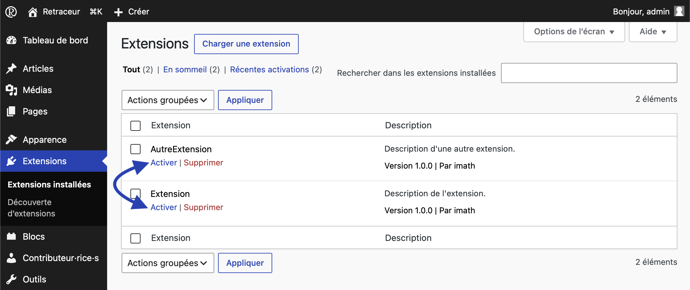

Après avoir cliqué sur ce lien, la page se recharge et vous confirmera la réussite de l'opération à l'aide d'un message sur fond vert positionné au-dessus du tableau. Par ailleurs, la rangée du tableau de toute extension activée présente une bordure gauche bleue foncée et plus épaisse et son arrière plan est colorée en bleu clair.

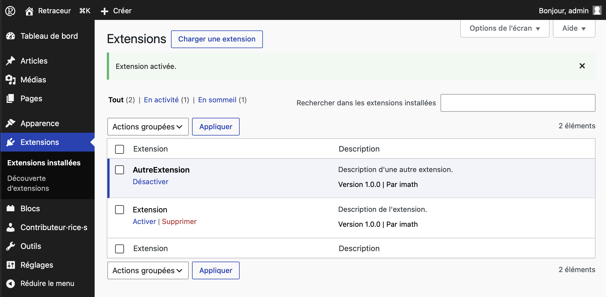

### Activation groupée

Vous pouvez également choisir d'activer une ou plusieurs extensions en cochant les cases à cocher correspondantes avant d'utiliser une des deux listes déroulantes des «&nbsp;Actions groupées&nbsp;» pour définir l'action d'activation comme illustré ci-dessous.

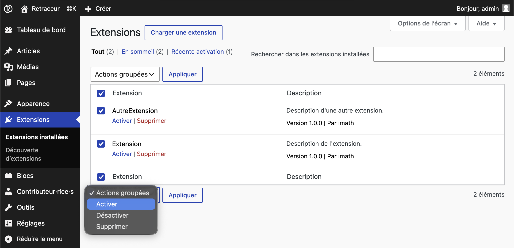

Cliquer ensuite sur le bouton «&nbsp;Appliquer&nbsp;» juste à droite de la liste déroulante pour lancer l'opération et découvrir au rechargement de la page que la ou les extensions sélectionnées ont effectivement été activées dans un message ayant un arrière plan vert positionné juste au-dessus du tableau des extensions.

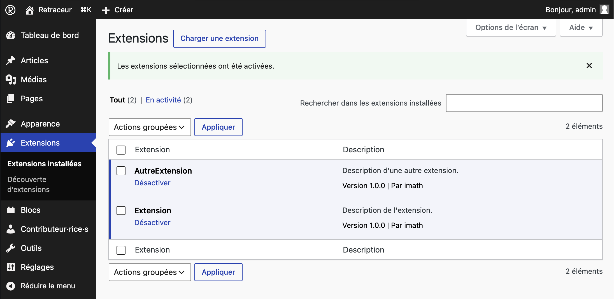

## Désactivation des extensions

Vous pouvez désactiver une ou plusieurs extensions de deux façons.

### Désactivation extension par extension

Sous le nom de chaque extension, le seul lien disponible permet de désactiver l'extension correspondante.

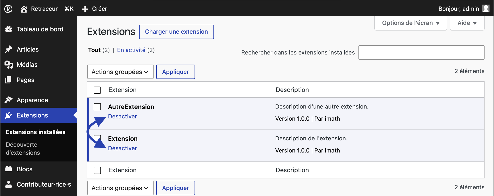

Après avoir cliqué sur ce lien, la page se recharge et vous confirmera la réussite de l'opération à l'aide d'un message ayant un arrière plan vert positionné au-dessus du tableau. Par ailleurs, la rangée du tableau de toute extension désactivée ne présentera pas de bordure plus épaisse et son arrière plan sera transparent.

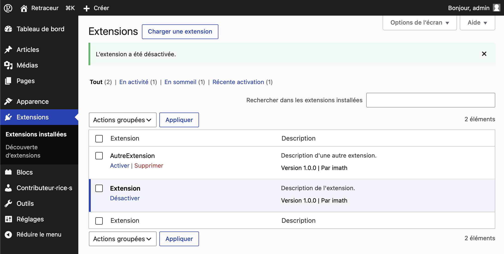

### Désactivation groupée

Vous pouvez également choisir de désactiver une ou plusieurs extensions en cochant les cases à cocher correspondantes avant d'utiliser une des deux listes déroulantes des «&nbsp;Actions groupées&nbsp;» pour définir l'action de désactivation comme illustré ci-dessous.

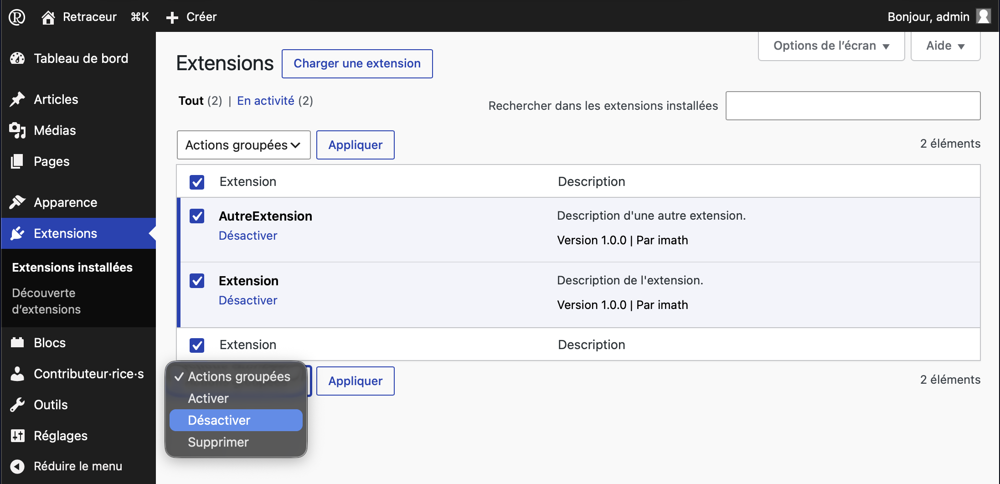

Cliquer ensuite sur le bouton «&nbsp;Appliquer&nbsp;» juste à droite de la liste déroulante pour lancer l'opération et découvrir au rechargement de la page que la ou les extensions sélectionnées ont effectivement été désactivées dans un message ayant un arrière plan vert positionné juste au dessus du tableau des extensions.

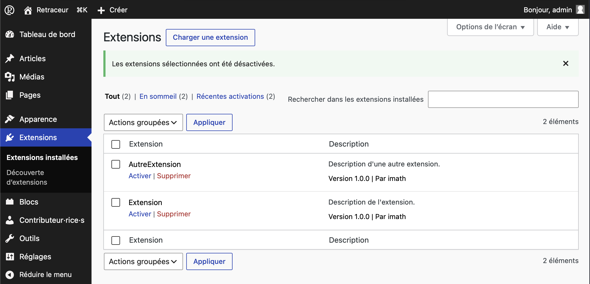

## Désinstallation des extensions

<Aside type="note">Tant qu'une extension est active, il n'est pas possible de la supprimer (désinstaller). Il s'agit de s'assurer de la désactiver avant sa désinstallation.</Aside>

Vous pouvez désinstaller une ou plusieurs extensions de deux façons.

### Désinstallation extension par extension

Sous le nom de chaque extension, le deuxième lien de couleur rouge vous permet de supprimer l'extension correspondante.

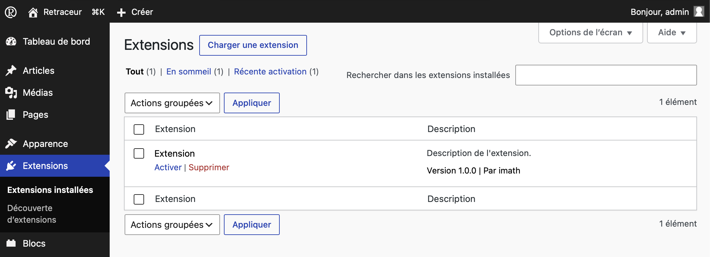

Après avoir cliqué sur ce lien, une fenêtre de dialogue vous demandera de confirmer votre action.

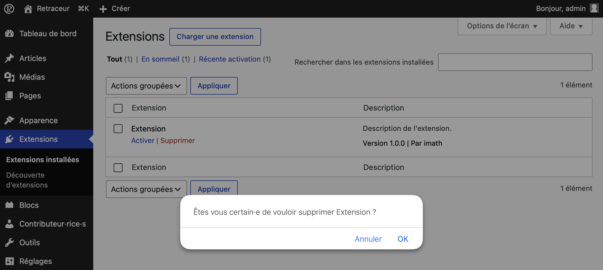

Après confirmation, la rangée de l'extension corresponsante sera remplacée par un message vous confirmant la suppression de l'extension.

### Désinstallation groupée

Vous pouvez également choisir de désinstaller une ou plusieurs extensions en cochant les cases à cocher correspondantes avant d'utiliser une des deux listes déroulantes des «&nbsp;Actions groupées&nbsp;» pour définir l'action de suppression comme illustré ci-dessous.

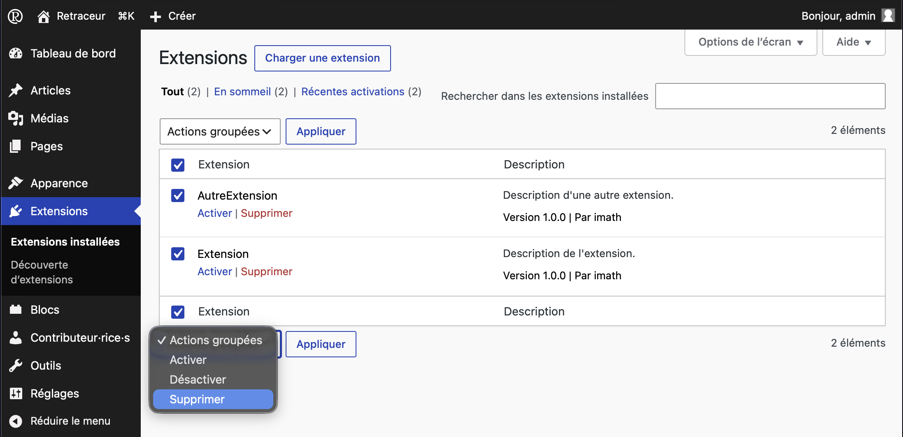

Cliquer ensuite sur le bouton «&nbsp;Appliquer&nbsp;» juste à droite de la liste déroulante. Une page intermédiaire vous demandera de confirmer votre souhait de supprimer la ou les extensions sélectionnées. Une fois confirmé, la ou les extensions seront effectivement désinstallées.

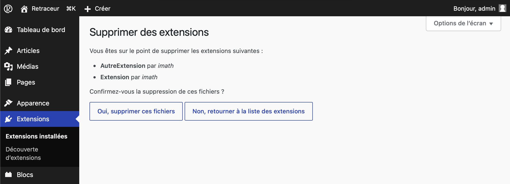