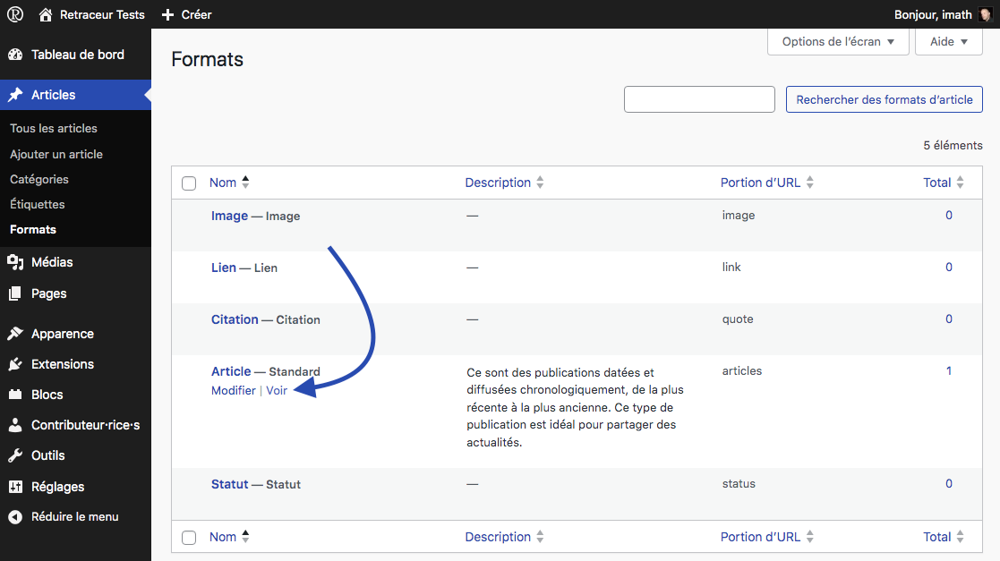
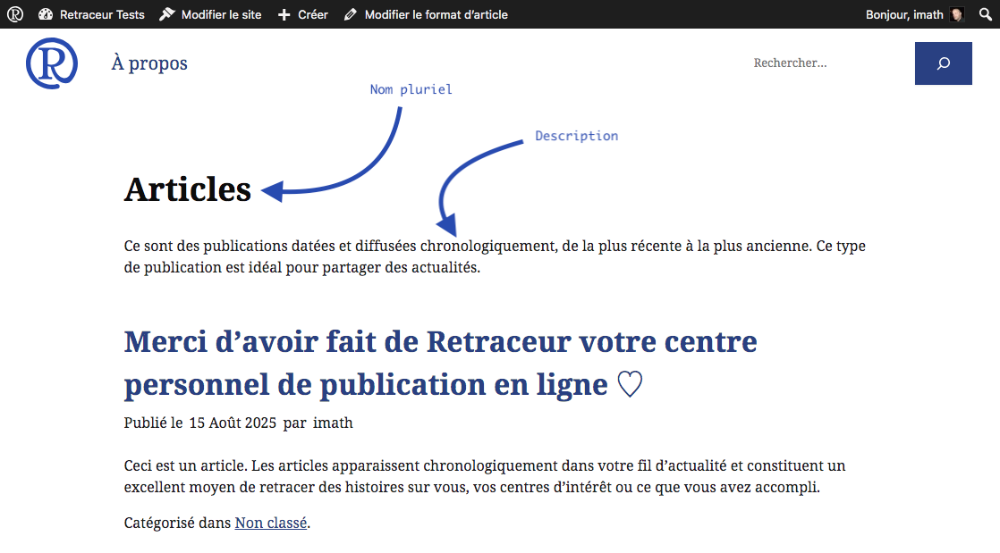

La fonctionnalité des formats d'article est contrôlée par le thème actif de votre site. L'interface d'administration décrite par la suite s'affichera uniquement si votre thème a déclaré sa prise en charge de cette fonctionnalité dans son fichier `functions.php`. Retraceur propose une liste de 11 formats d'article : `aside`, `audio`, `chat`, `code`, `gallery`, `image`, `link`, `quote`, `status`, `video` et `standard` (qui est le format par défaut). Un thème Retraceur peut « consentir » à supporter 1 ou plusieurs formats d'article à l'aide de son fichier `functions.php`. Par exemple le thème "Point" (qui est celui fournit par défaut dans Retraceur) prend en charge 4 formats d'article: `link`, `status`, `image`, `quote` (le format `standard` est toujours inclus à partir du moment où le thème a consenti à prendre en charge des formats d'articles). Si vous parcourez le code du [fichier `functions.php`](https://github.com/retraceur/coeur/blob/trunk/wp-content/themes/point/functions.php#L21) du thème "Point", vous découvrirez comment cette prise en charge est effectuée :

```php
// Utilisation de formats d'article spécifiques.
add_theme_support( 'post-formats', array( 'link', 'status', 'image', 'quote' ) );
```

En dehors du format `standard` qui résulte d'une rédaction/composition élaborée, Les formats d'article sont des contenus simples et directs permettants à leurs auteur·rice·s de rapidement publier ce qui leur passe par la tête (un peu comme ce qu'ils partagent sur les media sociaux). Les thèmes pour Retraceur doivent adapter l'affichage de ces contenus afin de les différencier des articles standards.

## Liste détaillée des formats d'article.

- `standard` : **c'est le format par défaut**. Les thèmes affichent généralement les titres, contenus et d'autres attributs d'article comme leur auteur·rice ou leur date de publication.
- `aside` : Les thèmes devraient n'afficher que du texte brut.
- `audio` : Les thèmes devraient n'afficher qu'un lecteur pour permettre aux visiteur·euse·s d'écouter le contenu audio.
- `chat` : Les thèmes devraient n'afficher que la transcription d'une conversation.
- `code` : Les thèmes devraient n'afficher que le code mis en forme grâce à la coloration syntaxique et des numéros de ligne.
- `gallery` : Les thèmes devraient n'afficher qu'une liste organisée de fichiers d'image.
- `image` : Les thèmes devraient n'afficher qu'une photo, un tableau (peinture).
- `link` : Les thèmes devraient n'afficher qu'un lien vers un autre site.
- `quote` : Les thèmes devraient n'afficher que la citation et son auteur·rice.                                  
- `status` : Les thèmes devraient n'afficher qu'une mise à jour du statut de l'auteur·rice, sur le même modèle que les messages courts partagés sur les media sociaux.
- `video` : Les thèmes devraient n'afficher qu'un lecteur pour permettre aux visiteur·euse·s de regarder le contenu vidéo.

## L'écran d'administration des formats d'article


Depuis le menu d'administration des **Articles**, cliquer sur le sous-menu "Formats" pour vous diriger vers l'écran d'administration correspondant.


L'écran d'administration des formats d'article affiche principalement un tableau de tous les formats que votre thème actif a décidé de supporter. Ce tableau contient 4 colonnes :

- La colonne "Nom" informe du nom personnalisé du format d'article et de son nom par défaut.
- La colonne "Description" est vide par défaut. La description du format d'article peut être utilisée pour indiquer à vos visiteur·euse·s les spécificités d'un format.
- La colonne "Portion d'URL" présente la partie de l'URL à utiliser à la suite de `https://urldevotre.site/type/` pour atteindre la page d'archive du format d'article.
- La colonne "Total" indique le nombre d'articles utilisant le format.

## Personnaliser un format d'article


En survolant le nom du format d'article, un lien permettant de modifier le format s'affiche. Vous pouvez également cliquer directement sur le nom du format d'article pour accéder au formulaire permettant de personnaliser ses noms au singulier et au pluriel, sa description et sa portion d'URL.


Une fois que vous êtes satisfait·e de la nouvelle valeur à utiliser pour chaque information, cliquez sur le bouton « Mettre à jour » pour enregistrer vos modifications.



Le lien « Voir » qui s'affiche lorsque vous survolez le nom du format d'article vous permet de vérifier à quoi ressemble la page d'archive du format d'article correspondant sur la partie frontale et publique de votre site.

