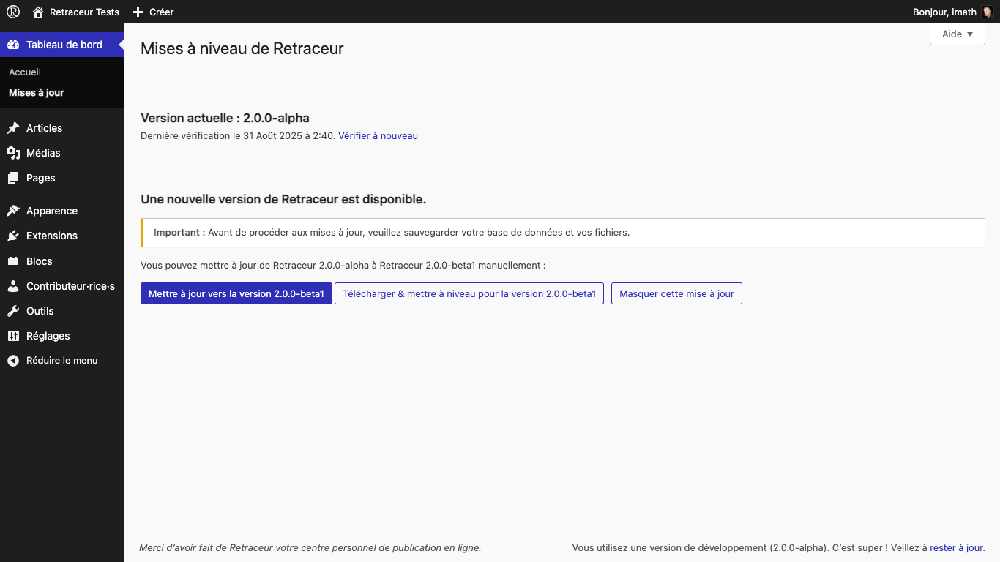
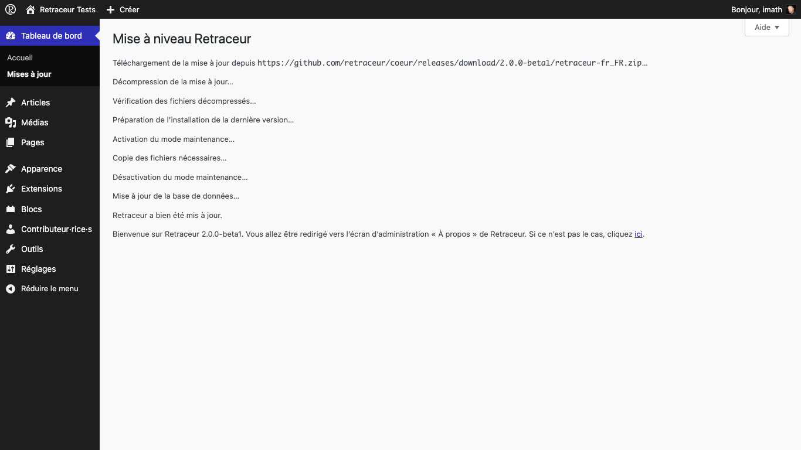

Garder votre site Web Retraceur à jour est essentiel ! Introduit dans la version 2.0.0 du logiciel, cet écran d'administration vous permet de le faire de la manière la plus efficace : celle que vous préférez. Dès qu'une nouvelle version de Retraceur sera disponible, une nouvelle section sera ajoutée sous la section « Version actuelle » pour vous permettre gérer cette mise à niveau.

## La mise à niveau en 1 clic

Tout d'abord : sauvegardez votre base de données, le répertoire `/wp-content` ainsi que les fichiers `wp-config.php` & `.htaccess` de votre site Web dans un dossier spécifique de votre ordinateur local.

Dés que vous aurez cliqué sur le bouton « **Mettre à jour vers la version X.Y.Z** », l'écran d'administration se rechargera et le processus de mise à niveau démarrera par le téléchargement de la nouvelle version de Retraceur.

Ensuite, les nouveaux répertoires et fichiers seront décompressés dans un dossier temporaire de votre site Web. Après avoir vérifié que tout est en place pour remplacer en toute sécurité tous les fichiers « Cœur » (la majeure partie du répertoire `/wp-content` »` est conservée intacte), le processus se poursuit jusqu'au message final « Bienvenue dans Retraceur X.Y.Z... ». Quelques secondes plus tard, vous serez redirigé·e vers l'écran « À propos » de votre administration pour découvrir les nouveautés apportées par cette mise à jour de Retraceur.

## La mise à niveau manuelle

Si faire le travail vous-même vous rassure, vous pouvez utiliser le bouton « **Télécharger et mettre à niveau pour la version X.Y.Z** » pour obtenir l'archive `retraceur.zip` contenant tous les fichiers dont vous aurez besoin pour effectuer votre mise à niveau manuelle. Merci de consulter [ce guide](./../../getting-started/upgrade) pour connaître la liste complète des étapes à accomplir pour mener à bien cette mise à  niveau.

## Ignorer une mise à niveau

Toutes les nouvelles versions de Retraceur seront répertoriées dans cet écran : les versions majeures, mineures et bêta/RC. Vous pouvez masquer une mise à jour en cliquant sur le bouton correspondant. Par exemple, si vous êtes sur un site de production, vous ne prendrez probablement pas le risque de tester les versions bêta !