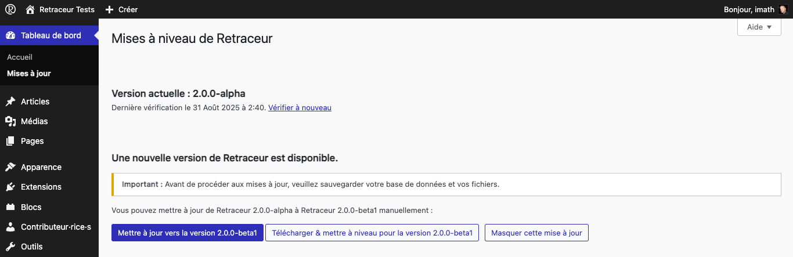
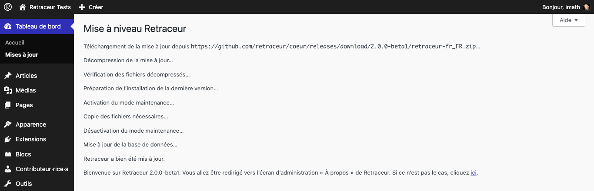
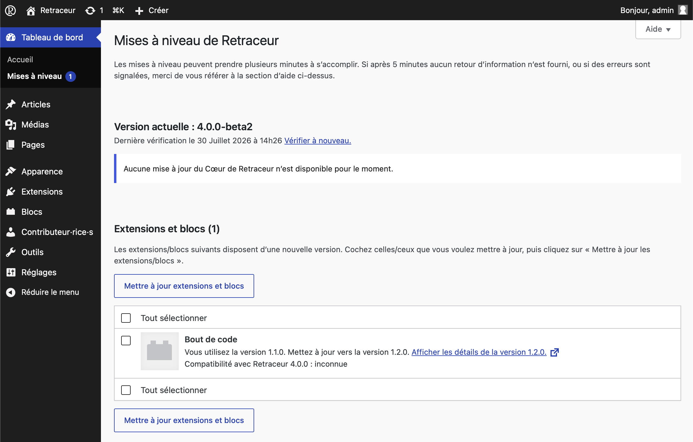
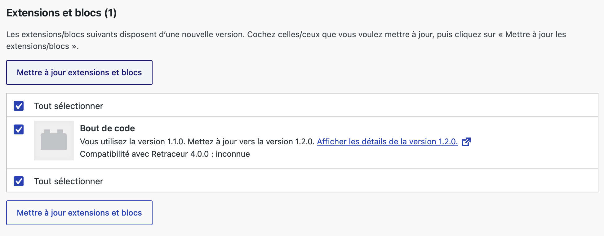
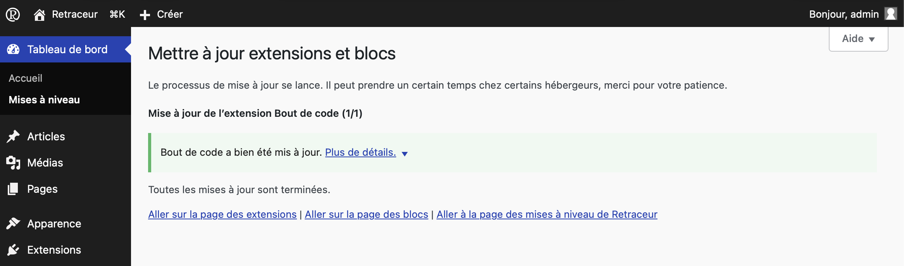

Garder le cœur de Retraceur à jour est essentiel ! Introduit dans la version 2.0.0 du logiciel, la première partie de cet écran d'administration vous permet de vous en assurer de la manière la plus efficace : celle que vous préférez. Dès qu'une nouvelle version de Retraceur sera disponible, une nouvelle section sera ajoutée sous la section « Version actuelle » pour vous permettre gérer cette mise à niveau.

La version 4.0.0 de Retraceur a ajouté la gestion des mises à jour des extensions et des blocs dans la deuxième partie de cet écran d'administration, en faisant le point central et unique pour la mise à jour de votre site web.

## Mise à niveau du cœur

Pour accéder à l'écran des « Mises à niveau », il vous suffit de passer la souris au-dessus du tout premier élément du menu, le « Tableau de bord », afin de faire apparaître le sous-menu « Mises à jour ». Cliquez dessus pour ouvrir la page d'administration correspondante.

### La mise à niveau en 1 clic

Tout d'abord : sauvegardez votre base de données, le répertoire `/wp-content` ainsi que les fichiers `wp-config.php` & `.htaccess` de votre site Web dans un dossier spécifique de votre ordinateur local.

Dés que vous aurez cliqué sur le bouton « **Mettre à jour vers la version X.Y.Z** », l'écran d'administration se rechargera et le processus de mise à niveau démarrera par le téléchargement de la nouvelle version de Retraceur.

Ensuite, les nouveaux répertoires et fichiers seront décompressés dans un dossier temporaire de votre site Web. Après avoir vérifié que tout est en place pour remplacer en toute sécurité tous les fichiers « Cœur » (la majeure partie du répertoire `/wp-content` »` est conservée intacte), le processus se poursuit jusqu'au message final « Bienvenue dans Retraceur X.Y.Z... ». Quelques secondes plus tard, vous serez redirigé·e vers l'écran « À propos » de votre administration pour découvrir les nouveautés apportées par cette mise à jour de Retraceur.

### La mise à niveau manuelle

Si faire le travail vous-même vous rassure, vous pouvez utiliser le bouton « **Télécharger et mettre à niveau pour la version X.Y.Z** » pour obtenir l'archive `retraceur.zip` contenant tous les fichiers dont vous aurez besoin pour effectuer votre mise à niveau manuelle. Merci de consulter [ce guide](./../../getting-started/upgrade) pour connaître la liste complète des étapes à accomplir pour mener à bien cette mise à  niveau.

### Ignorer une mise à niveau

Toutes les nouvelles versions de Retraceur seront répertoriées dans cet écran : les versions majeures, mineures et bêta/RC. Vous pouvez masquer une mise à jour en cliquant sur le bouton correspondant. Par exemple, si vous êtes sur un site de production, vous ne prendrez probablement pas le risque de tester les versions bêta !

## Mise à niveau des extensions et des blocs

La mise à jour des extensions et des blocs s'effectue depuis le même écran des «&nbsp;Mises à niveau&nbsp;»&nbsp;;&nbsp;vous trouverez, sous la section « Mises à niveau de Retraceur », celle dédiée aux plugins et aux blocs.

Cochez les cases correspondant aux blocs et/ou aux extensions que vous souhaitez mettre à jour, puis cliquez sur l'un des boutons « Mettre à jour extensions et blocs » pour lancer le processus.

Retraceur lancera le téléchargement de la ou des archives ZIP avant de procéder à leur installation. Si tout s'est bien passé, un encadré vert s'affichera pour le confirmer.

