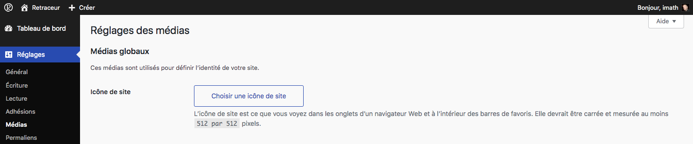
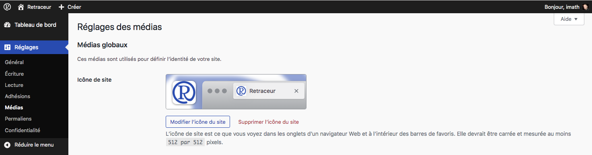
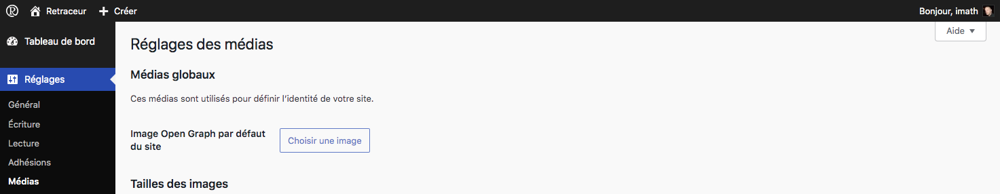
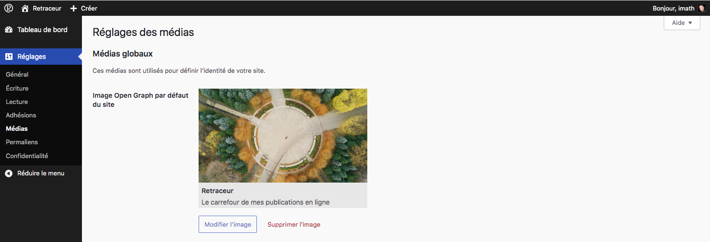
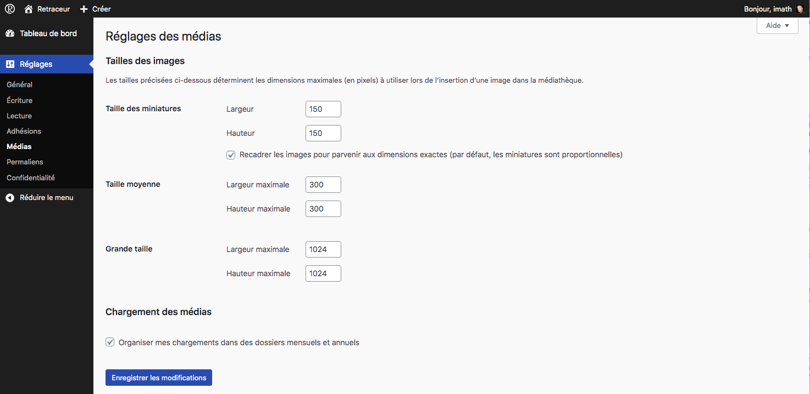

L’écran d'administration des **Réglages → Médias** permet de définir certains paramètres globaux liés à l’utilisation des images dans Retraceur. Ces réglages concernent notamment : l’icône du site, l’image Open Graph utilisée par défaut, les tailles d’images générées lors de l’envoi d’un fichier. Ces paramètres s’appliquent à l’ensemble du site.

## Icône du site

L’icône du site est l’image utilisée pour représenter votre site dans différents contextes :

- onglets du navigateur ;
- favoris ;
- raccourcis sur l’écran d’accueil d’un appareil.

Cette icône est parfois appelée favicon.

### Définir l’icône du site

Pour définir une icône :

1. cliquez sur Choisir une image ;
2. sélectionnez une image dans la médiathèque ou téléversez-en une nouvelle ;
3. n'oubliez pas d'enregistrez les modifications grâce au bouton bleau « Enregistrer les modifications » situé tout en bas de l'écran d'administration des réglages de médias.

Il est recommandé d’utiliser une image carrée d’au moins 512 × 512 pixels. Retraceur génère automatiquement les variantes nécessaires pour les navigateurs et les appareils.

Une fois les modifications enregistrées, vous pouvez à tout moment changer ou enlever l'icône du site en utilisant les boutons correspondants.

## Image Open Graph par défaut

Retraceur inclut une Open Graph API permettant de contrôler les informations utilisées lors du partage d’une page. L’image Open Graph définie ici est utilisée lorsqu’aucune image n’est explicitement définie pour un contenu. Elle permet d’assurer qu’un lien partagé vers votre site dispose toujours d’une illustration.

### Définir l’image par défaut

Pour définir l’image Open Graph par défaut, c'est très similaire à la manière de régler l'icône de site :

1. cliquez sur Choisir une image ;
2. sélectionnez une image dans la médiathèque ou téléversez-en une nouvelle ;
3. enregistrez les modifications.

Pour un affichage optimal sur la plupart des plateformes, il est recommandé d’utiliser une image d’environ 1200 × 630 pixels.

Une fois les modifications enregistrées, vous pouvez à tout moment changer ou enlever l'image Open Graph par défaut en utilisant les boutons correspondants.

## Tailles des images

Lors de l’envoi d’une image dans la médiathèque, Retraceur génère automatiquement plusieurs tailles. Ces tailles peuvent être utilisées par les thèmes, les blocs ou certaines fonctionnalités de l’interface.

Les champs présents dans cette section permettent de définir :

- la largeur maximale ;
- la hauteur maximale ;
- le comportement de recadrage.

Les modifications apportées à ces réglages n’affectent que les images envoyées après l’enregistrement des paramètres.