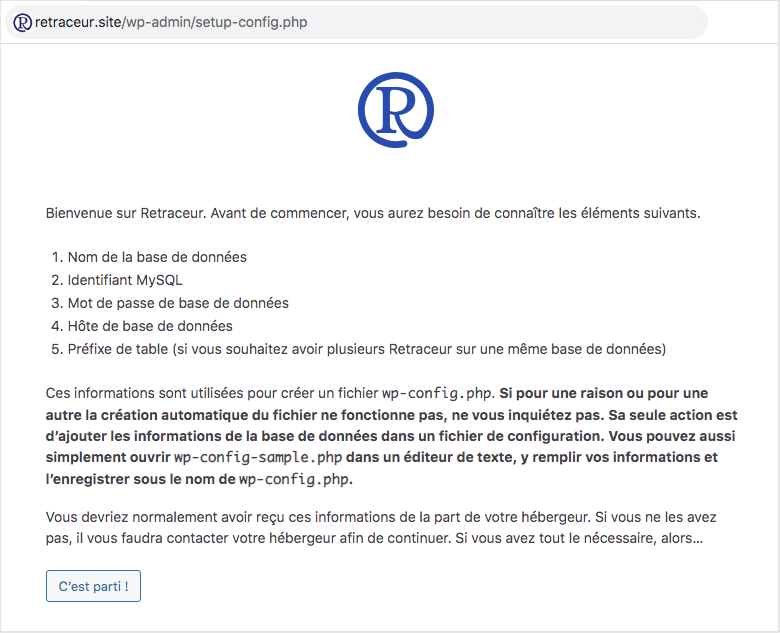
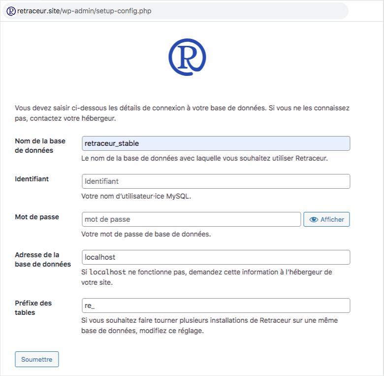
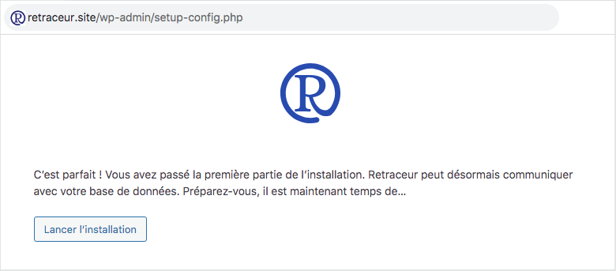
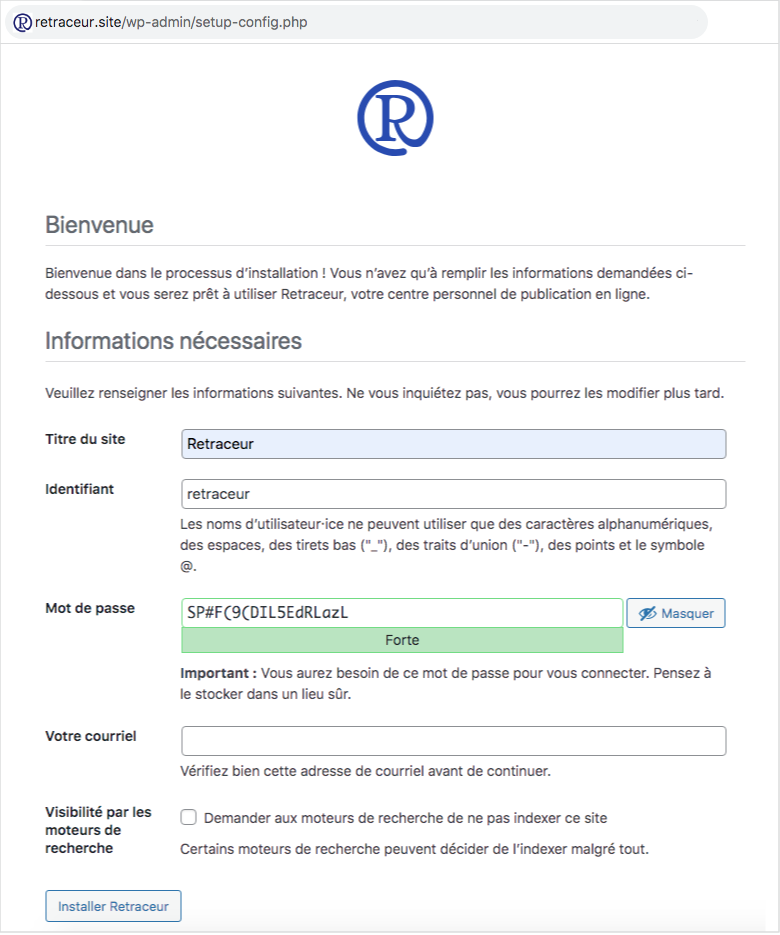
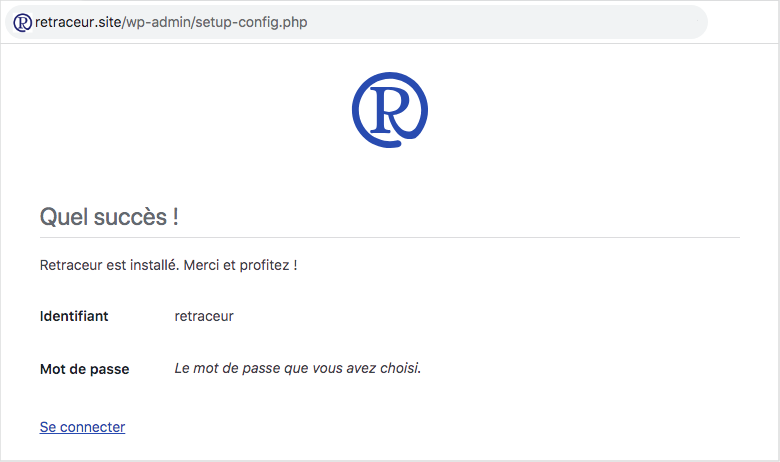
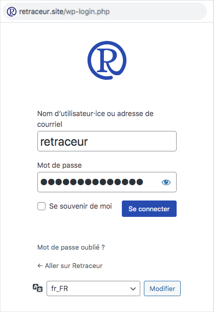
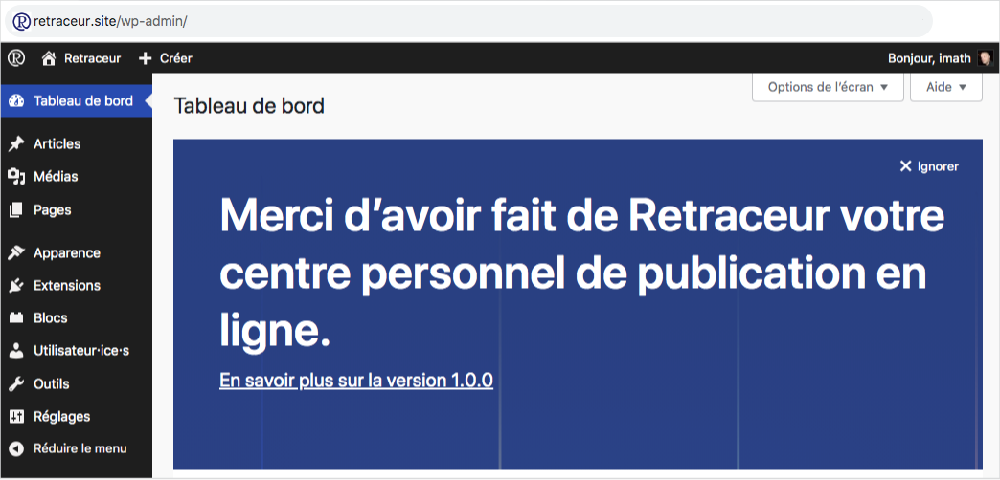

import { FileTree } from '@astrojs/starlight/components';

Ce guide vous aidera à démarrer avec Retraceur. Ce logiciel nécessite a minima la version 7.2.24 de [PHP](https://www.php.net/) (les versions recommandées sont 7.4 ou plus), la version 5.5.5 de [MySQL](https://www.mysql.com/) (les versions recommandées sont 8.0 ou plus), et un serveur Web exécutant [Apache](https://httpd.apache.org/) (avec le module `mod_rewrite` activé) ou [Nginx](https://nginx.org/). Si votre configuration répond à ces exigences, vous pouvez passer à l'étape 1 du processus d'installation !

## Étape 1

1. Connectez-vous à votre serveur MySQL et créez une nouvelle base de données en choisissant l'encodage de caractère `utf8mb4_general_ci`.
2. Obtenez la dernière version stable de Retraceur à partir de la page des [versions du logiciel sur GitHub](https://github.com/retraceur/coeur/releases).
3. Accédez à la section Assets de la page de la version et cliquez sur le fichier `retraceur-fr_FR.zip` pour télécharger l'archive de Retraceur.

## Étape 2

Décompressez l'archive `retraceur-fr_FR.zip` et transférez tous les répertoires et fichiers du répertoire `retraceur-fr_FR` vers le [DocumentRoot](https://httpd.apache.org/docs/2.4/en/urlmapping.html#documentroot) de votre serveur Web. Vous devriez obtenir l'arborescence de fichiers suivante :

<FileTree>

- index.php
- LICENSE.md
- README.md
- wp-activate.php
- wp-admin/
  - about.php
  - ...
- ...
- wp-content/
  - index.php
  - plugins/
  - themes/
- wp-cron.php
- wp-includes/
  - admin-bar.php
  - ...
- ...

</FileTree>

Accédez à la page d'accueil de votre site. Vous devriez être redirigé vers la page d'installation de Retraceur illustrée ci-dessous.

## Étape 3

Vous devez maintenant configurer la connexion à la base de données de votre site Web :

1. Dans le champ `Nom de la base de données` : utilisez le nom que vous avez choisi pour votre base de données à la toute première étape de ce guide.
2. Dans le champ `Identifiant` : utilisez le nom d'utilisateur·rice MySQL qui peut accéder à cette base de données.
3. Dans le champ `Mot de passe` : utilisez le mot de passe du nom d'utilisateur·rice MySQL.
4. Dans le champ `Adresse de la base de données` : utilisez l’adresse du serveur MySQL fourni par votre service d'hébergement Web.
5. Dans le champ `Préfixe des tables` : vous pouvez éventuellement personnaliser le préfixe que Retraceur utilisera avant ses noms de table.

Tout est prêt ? Super, vous pouvez cliquer sur le bouton « Soumettre » pour tester la connexion SQL et enregistrer cette configuration en cas de succès. Si quelque chose n'est pas configuré comme il faut, le processus d'installation vous demandera de recommencer cette étape.

Si tout est en place, vous verrez la page ci-dessus. Cliquez sur le bouton « Lancer l'installation » pour définir les détails de votre site Web.

## Étape 4

Il est temps de définir le titre de votre site Web, votre nom d'utilisateur·rice et votre mot de passe (en veillant à définir un mot de passe robuste) pour accéder au tableau de bord de votre site Web, ainsi que l'adresse de courriel que vous utiliserez pour éventuellement réinitialiser votre mot de passe ou recevoir des notifications de votre site Web. Si vous ne souhaitez pas que les moteurs de recherche indexent votre site, vous pouvez cocher la case correspondante.

Cliquez enfin sur le bouton « Installer Retraceur » pour définir ces informations et accéder à la page illustrée ci-dessous.

Vous pouvez maintenant cliquer sur le bouton « Se connecter » pour accéder au tableau de bord de Retraceur et commencer à rédiger de superbes publications.

## Étape finale

Une fois sur la page de connexion, utilisez le nom d'utilisateur·rice et le mot de passe que vous avez définis à l'étape précédente pour remplir les champs correspondants et cliquez sur le bouton « Se connecter ».

Tu l'as fait ! Beau travail 🤝