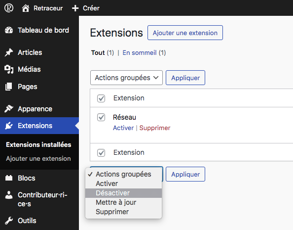
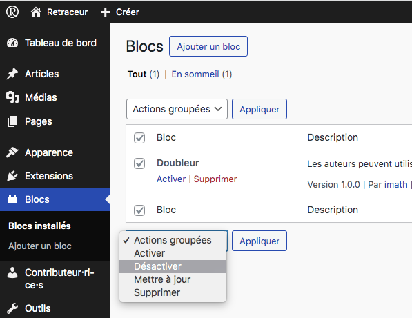
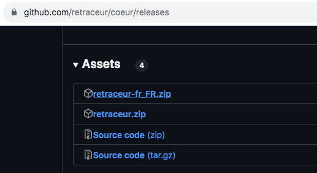

import { FileTree } from '@astrojs/starlight/components';
import { Aside } from '@astrojs/starlight/components';

Il est très important de maintenir Retraceur à jour dans sa dernière version stable. Pour être informé·e de la disponibilité d'une nouvelle version de Retraceur, vous pouvez vous abonner au flux [Bluesky feed](https://bsky.app/profile/retraceur.bsky.social) du logiciel ou à son flux [des versions disponibles sur GitHub](https://github.com/retraceur/coeur/releases.atom).

<Aside type="caution">
  Le processus de mise à jour affectera tous les fichiers et dossiers inclus dans l'installation de Retraceur. Cela inclut tous les fichiers de son coeur utilisés pour faire fonctionner Retraceur. Si vous avez apporté des modifications à ces fichiers, elles seront perdues.
</Aside>

## Étape 1: Sauvegardez votre base de données

Il est extrêmement important de sauvegarder votre base de données avant de commencer la mise à jour. Si, pour une raison quelconque, vous jugez nécessaire de revenir à l'« ancienne » version de Retraceur, vous devrez peut-être restaurer votre base de données à partir de cette sauvegarde. Une fois que vous avez téléchargé votre sauvegarde au format `.sql`, ouvrez-la dans un éditeur de texte pour vérifier qu'elle contient bien toutes les tables de votre base de données, leurs schémas et leurs données.

## Étape 2: Sauvegardez certains fichiers importants de votre site Web

En utilisant un logiciel FTP tel que [FileZilla](https://filezilla-project.org/), assurez-vous de télécharger le répertoire `/wp-content` ainsi que les fichiers `wp-config.php` & `.htaccess` de votre site Web dans un dossier local spécifique de votre ordinateur. Une fois que vous avez téléchargé ces fichiers, ouvrez le dossier local dans un éditeur de texte pour vérifier que vous pouvez lire le contenu du fichier `wp-config.php` et naviguer dans les sous-répertoires du dossier `/wp-content`.

## Étape 3: Désactivez TOUTES vos extensions et TOUS vos blocs

|||
|:-:|:-:|

Allez dans la zone de gestion des extensions de votre tableau de bord Retraceur, sélectionnez toutes les extensions installées et désactiver les grâce à l'action de masse correspondante comme illustré dans la capture d'écran ci-dessus. Effectuez la même opération depuis la zone d'administration des blocs. Cette étape permet d'éviter tout conflit avec d'éventuels extensions ou blocs lors de mise à jour de Retraceur.

## Étape 4: Téléchargez et extrayez l'archive Zip de Retraceur

Ouvrez la page de la version la plus récente de la liste des versions de Retraceur sur [GitHub](https://github.com/retraceur/coeur/releases). Depuis la section « Assets », téléchargez le fichier `retraceur-fr_FR.zip` et décompressez-le sur votre ordinateur local. Les fichiers de Retraceur seront extraits dans un dossier qui s'appellera `retraceur-fr_FR`.

<Aside type="note" title="Traduction de Retraceur">
  Si vous utilisez Retraceur dans sa version française, assurez-vous d'également télécharger et extraire le catalogue de langue française que Retraceur fournit dans ce [dépôt GitHub](https://github.com/retraceur/fr-fr). Ce catalogue de langue sera extrait dans un dossier s'appelant `fr-fr-{version}`.
</Aside>

## Étape 5: Enlevez les fichiers de Retraceur périmés de votre site Web

Supprimez tous les fichiers sauf le répertoire `/wp-content` et les fichiers `wp-config.php` & `.htaccess`. Supprimez ensuite le répertoire `/wp-content/themes/point` : il contient le thème par défaut de Retraceur qui est inclus dans la nouvelle version de Retraceur.

<Aside type="note" title="Traduction de Retraceur">
  Si vous utilisez Retraceur dans sa version française, dans le répertoire `/wp-content/languages` de votre site Web: retirez tous les fichiers de langue à l'exception des dossiers `/wp-content/languages/plugins` et `/wp-content/languages/themes`.
</Aside>

L'arborescence des fichiers de votre site Web devrait ressembler à ceci :

<FileTree>

- .htaccess
- wp-config.php
- wp-content/
  - index.php
  - languages/
    - plugins/
    - themes/
  - plugins/
  - themes/
  - uploads/

</FileTree>

## Étape 6: Chargez les nouveaux fichiers

En utilisant un logiciel FTP tel que [FileZilla](https://filezilla-project.org/), copiez tous les fichiers et dossiers à l'exception du répertoire `/wp-content` de la nouvelle version de Retraceur contenue dans le dossier `retraceur-fr_FR` de l'étape 4 et coller les au niveau de la racine de l'arborescence des fichiers de votre site Web. Ensuite, copiez le dossier `/wp-content/themes/point` contenu dans le répertoire local  `retraceur-fr_FR` et collez le dans le répertoire `/wp-content/themes` de votre site Web.

<Aside type="note" title="Traduction de Retraceur">
  Si vous utilisez Retraceur dans sa version française, copiez tous les fichiers contenus dans le dossier extrait (`fr-fr-{version}`) pour votre catalogue de langue française dans le répertoire `/wp-content/languages`. Dans l'arborescence ci-dessous, le répertoire `/wp-content/languages` montre à quoi vous attendre dans le cas d'une mise à jour du catalogue de langue française.
</Aside>

L'arborescence des fichiers de votre site Web devrait maintenant ressembler à ce qui suit :

<FileTree>

- .htaccess
- index.php
- LICENSE.md
- README.md
- wp-activate.php
- wp-admin/
  - about.php
  - ...
- ...
- wp-config.php
- wp-content/
  - index.php
  - languages/
    - plugins/
    - themes/
    - admin-fr_FR.mo
    - admin-fr_FR.po
    - continents-cities-fr_FR.mo
    - continents-cities-fr_FR.po
    - fr_FR-0cc31205f20441b3df1d1b46100f6b8d.json
    - ...
    - fr_FR.mo
    - fr_FR.po
  - plugins/
  - themes/
    - point/
      - ...
- wp-cron.php
- wp-includes/
  - admin-bar.php
  - ...
- ...

</FileTree>

## Étape 7: Exécutez le script de mise à jour de la base de données

A l'aide d'un navigateur Web, accédez à votre tableau de bord Retraceur via l'URL `https://site.url/wp-admin`. Retraceur vérifiera si une mise à jour de la base de données est nécessaire, et si c'est le cas, il vous affichera un nouveau lien à suivre.

Ce lien vous fera ouvrir la page `wp-admin/upgrade.php` pour exécuter le script de mise à jour de la base de données de Retraceur. Veillez à respecter les instructions qui s'afficheront à l'écran.

## Étape 8: Installez les versions des extensions, blocs et thèmes les plus récentes

Veillez à visiter les pages Web de chaque extension, bloc et thème et recherchez les informations relatives à la compatibilité avec votre nouvelle version de Retraceur. Installez de nouvelles versions de vos extensions, blocs et thèmes, si nécessaire.

<Aside type="note" title="Traduction de Retraceur">
  Si vous utilisez Retraceur dans sa version française, vous aurez probablement besoin d'également télécharger et extraire les catalogues de langue française pour vos extensions, blocs et thèmes installés. Le contenu de ces dossiers de catalogue extraits seront à copier dans le répertoire `/wp-content/languages/plugins` pour vos extensions et blocs installés et dans le dossier `/wp-content/languages/themes` pour vos thèmes.
</Aside>

## Étape 9: Réactivez les extensions et les blocs

Allez dans la zone de gestion des extensions de votre tableau de bord Retraceur, activez chaque extension, une par une, en vérifiant qu'il n'y a pas de problème après chaque réactivation avant de continuer. Une fois que c'est fait, faites la même chose pour tous vos blocs à partir de l'écran d'Administration des blocs.

Beau boulot 💪.