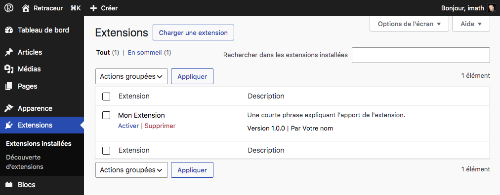

import { FileTree } from '@astrojs/starlight/components';
import { Code } from '@astrojs/starlight/components';

export const pluginCode = `<?php
/**
 * Plugin Name: Mon extension
 * Description: Une courte phrase expliquant ce qu'apporte l'extension.
 * Version: 1.0.0
 * Author: Votre nom
 * Requires Retraceur: 4.0.0
 */
`;
export const pluginFileName = 'mon-extension/mon-extension.php';

export const blockCode = `<?php
/**
 * Plugin Name: Mon bloc
 * Plugin Type: block
 * Description: Une courte phrase expliquant ce qu'apporte le bloc.
 * Version: 1.0.0
 * Author: Votre nom
 * Requires Retraceur: 4.0.0
 */
`;
export const blockFileName = 'mon-bloc/mon-bloc.php';
export const highlight = `Plugin Type: block`;

Retraceur peut être étendu de deux manières complémentaires : les extensions et les blocs. Techniquement, il s’agit dans les deux cas du même type de ressource — un ensemble de fichiers PHP (pouvant également inclure du JavaScript, du CSS, etc.), situé dans le répertoire `/wp-content/plugins` de votre site web. Ce qui différencie extensions et blocs, c’est leur finalité.

- Une extension enrichit les fonctionnalités de Retraceur : elle peut ajouter un nouveau paramètre, un nouvel écran d’administration, modifier le fonctionnement en arrière-plan, etc.
- Un bloc enrichit l’expérience de rédaction : il vous offre une nouvelle façon de composer vos articles, vos pages ou d'organiser la mise en page de votre site directement depuis l’éditeur de blocs.

En raison de cette différence de finalité, les extensions sont gérées depuis l’écran d’administration des Extensions, tandis que les blocs sont gérés depuis l’écran d’administration des Blocs. En réalité, un bloc est une extension : une extension typée comme étant un bloc, comme vous le verrez ci-après.

## Tout commence par un simple fichier PHP 

Que vous développiez une extension ou un bloc, tout commence par le fichier PHP principal — celui que Retraceur chargera en premier, souvent appelé fichier de « boot ». Ce fichier doit contenir un commentaire d'en-tête décrivant votre projet : son nom, sa version, son responsable, les versions de Retraceur qu'il prend en charge, etc.

Ce commentaire d'en-tête est ce que Retraceur examine pour lister votre projet dans les écrans d'administration des extensions ou des blocs de votre site. C'est tout ce qui est nécessaire pour démarrer : dès qu'un commentaire d'en-tête valide est trouvé et analysé, votre extension ou votre bloc apparaissent et sont prêts à être activés.

Voici un commentaire d'en-tête minimaliste valide pour une extension :

<Code code={pluginCode} lang="php" title={pluginFileName} />

Pour la transformer en bloc, il suffit d'ajouter cette ligne dans le commentaire d'en-tête : `Plugin Type: block`.

<Code code={blockCode} lang="php" title={blockFileName} mark={highlight} />

## Structure de fichiers recommandée

Un simple fichier PHP suffit pour démarrer, mais un projet destiné à être partagé et maintenu dans la durée gagne à être un peu mieux structuré. Retraceur héberge son propre [code source](https://github.com/retraceur/coeur) sur GitHub, et il est recommandé de respecter les conventions de cet écosystème pour vos extensions et vos blocs également.

<FileTree>

- index.php
- ...
- wp-content/
  - index.php
  - ...
  - plugins/
    - mon-extension/
      - mon-extension.php
      - README.md
      - CHANGELOG.md
      - CONTRIBUTING.md
      - CODE_OF_CONDUCT.md
      - SECURITY.md
      - LICENSE.md
      - ...
- ...

</FileTree>

Aucun de ces fichiers supplémentaires n'est lu par Retraceur : ils sont destinés aux personnes qui utiliseront, installeront et contribueront éventuellement à votre projet.

| Fichier Markdown | Description |
| --- | --- |
| **README.md** | Présente les fonctionnalités de votre extension / bloc et explique comment l'installer. |
| **CHANGELOG.md** | Permet de suivre les modifications apportées d'une version à l'autre. |
| **CONTRIBUTING.md** | Explique comment les autres peuvent aider. |
| **CODE_OF_CONDUCT.md** | Explique comment les autres doivent se comporter lorsqu'ils·elles apportent leurs contributions. |
| **SECURITY.md** | Explique aux utilisateur·rice·s comment signaler une faille de sécurité de manière responsable. |
| **LICENSE.md** | Précise les conditions dans lesquelles votre code peut être réutilisé. Retraceur étant distribué sous licence GNU GPL v2.0, assurez-vous que la licence que vous choisissez soit compatible avec celle-ci. |

## Prêt à partager ?
 
Si vous avez choisi d'héberger le code de votre extension ou de votre bloc sur GitHub, vous pouvez aller encore plus loin : les rendre accessibles, installables et actualisables depuis n'importe quel site web Retraceur, sans rien publier ailleurs.
 
[Apprenez en plus sur le partage d’extensions et de blocs →](./publish)