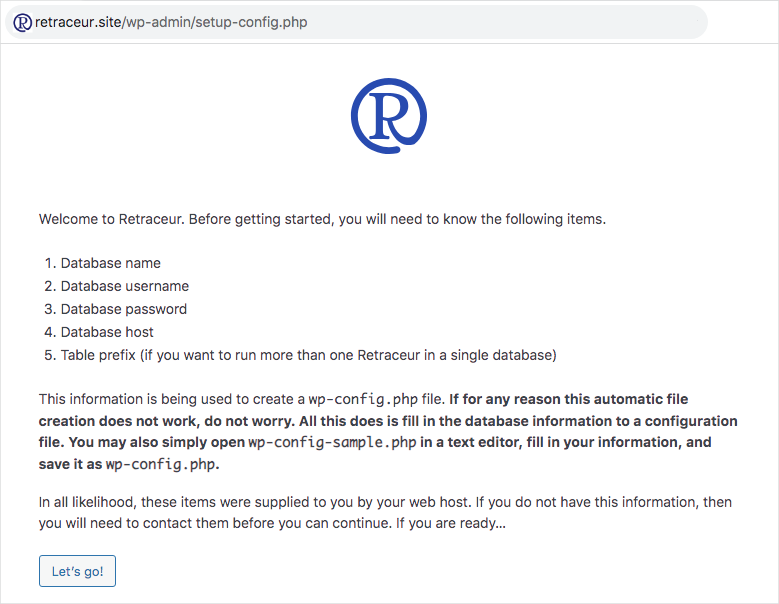

import { FileTree } from '@astrojs/starlight/components';

This guide will help you get started with Retraceur. This Software needs at least the 7.2.24 version of [PHP](https://www.php.net/) (recommanded versions are 7.4 or up), the 5.5.5 version of [MySQL](https://www.mysql.com/) (recommanded versions are 8.0 or up), and a Web server running [Apache](https://httpd.apache.org/) (with `mod_rewrite` module on) or [Nginx](https://nginx.org/). If your configuration meets these requirements, you can move to Step 1 of the installation process!

## Step 1

1. Connect to your MySQL server and create a new database choosing the `utf8mb4_general_ci` language encoding.
2. Get the latest stable version of Retraceur from the software [releases page on GitHub](https://github.com/retraceur/coeur/releases).
3. Go to the Assets section of the release's page and click on the `retraceur.zip` file to download the Retraceur package.

## Step 2

Unzip the `retraceur.zip` package and move all the directory and files within the  `retraceur` directory to the [DocumentRoot](https://httpd.apache.org/docs/2.4/en/urlmapping.html#documentroot) of your Web server. You should get the following files tree:

<FileTree>

- index.php
- LICENSE.md
- README.md
- wp-activate.php
- wp-admin/
  - about.php
  - ...
- ...
- wp-content/
  - index.php
  - plugins/
  - themes/
- wp-cron.php
- wp-includes/
  - admin-bar.php
  - ...
- ...

</FileTree>

Go to the your site's landing page. You should be redirected to the following Retraceur installation page.

## Step 3

You now need to set up the connexion to your Website's database:

1. Into the `Database Name` field: use the name you choose for your database at the very first step of this guide.
2. Into the `Username` field: use the MySQL username who can access to this database.
3. Into the `Password` field: use the MySQL username's password.
4. Into the `Database Host` field: use the MySQL server Host name your Web hosting service provided.
5. Into the `Table prefix` field: you can eventually customize the prefix Retraceur will use before its table names.

All set? Great, you can hit the "Submit" button to test the SQL connexion and save this config on success. If something is not set the way it should, the installation process will ask you to start again this step.

If everything is in place, you'll see the above page. Click on the "Run the installation" button to define your Website details.

## Step 4

It's time to define your Website’s title, your username and password (making sure to define a robust one) to access to your Website's Dashboard, as well as the email address you will use to eventually reset your password or receive notifications from your Website. If you don't want Search engines to index your site, you can activate the corresponding checkbox.

Finally click on the "Install Retraceur" button to set this information and reach the following page.

You can now click on the "Log in" button to reach your Retraceur Dashboard and start writing great publications.

## Final step

Once on the Login page, use the username and password you defined at previous step to fill the corresponding fields and click on the "Log in" button.

You did it! Great job 🤝