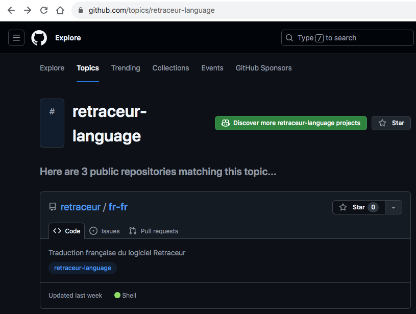
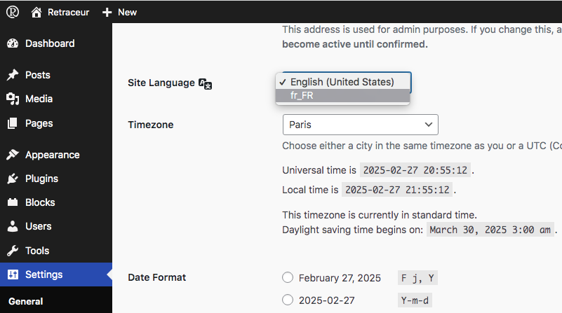

import { FileTree } from '@astrojs/starlight/components';
import { Aside } from '@astrojs/starlight/components';

Here are the steps you will need to follow to install an international version of Retraceur.

<Aside type="caution">If you make an error in the steps or you do not specify the correct language, Retraceur will default back to English.</Aside>

## Step 1

1. Browse the [retraceur-language](https://github.com/topics/retraceur-language) topic on GitHub to find the language files you wish to use for your Retraceur site.
2. Download the language catalog release matching your Retraceur version (pick the `languages.zip` asset, if provided).

## Step 2

Unzip the Zip package you downloaded and move its content inside the `wp-content/languages` directory of your website. You should get the following files tree:

<FileTree>

- index.php
- LICENSE.md
- README.md
- ...
- wp-content/
  - ...
  - languages/
   - admin-fr_FR.mo
   - admin-fr_FR.po
   - continents-cities-fr_FR.mo
   - continents-cities-fr_FR.po
   - fr_FR-0cc31205f20441b3df1d1b46100f6b8d.json
   - ...
   - fr_FR.mo
   - fr_FR.po
- ...

</FileTree>

<Aside>If you downloaded a different language catalog than the `fr_FR` one, your language files will be different and use one of [these locale codes](../locales) into their file names.</Aside>

## Step 3

1. Go to your Retraceur Dashboard.
2. Open the Settings / General Administration screen, as shown above.
3. Find the Site Language option and select the locale code of your language catalog.
4. Scroll down to the bottom of the page and click on the « Save Changes » blue button.

Your website should now be translated into the language you installed. If, it's not the case: go back to step 1 and try again 😬.