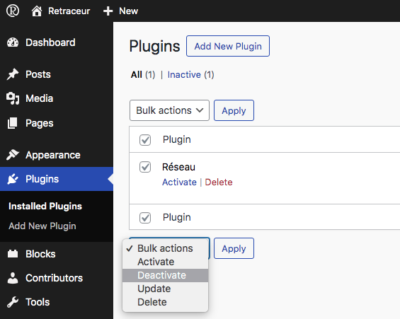
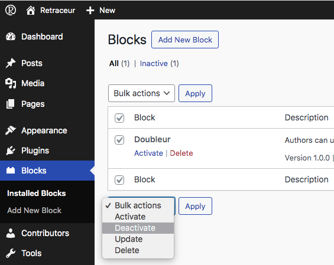

import { FileTree } from '@astrojs/starlight/components';
import { Aside } from '@astrojs/starlight/components';

It's very important to keep Retraceur updated to its latest stable version. To be informed when a new version of Retraceur is available, you can alternatively subscribe to the software's [Bluesky feed](https://bsky.app/profile/retraceur.bsky.social) or its [GitHub Releases](https://github.com/retraceur/coeur/releases.atom) feed.

<Aside type="caution">
  The upgrade process will affect all files and folders included in the main Retraceur installation. This includes all the core files used to run Retraceur. If you have made any modifications to those files, your changes will be lost.
</Aside>

## Step 1: Back up your database

It is extremely important to back up your database before beginning the upgrade. If, for some reason, you find it necessary to revert back to the ‘old’ version of Retraceur, you may have to restore your database from these backups. Once you've downloaded your `.sql` backup, open it into a text editor to check it actually includes all your db tables schema and data.

## Step 2: Back up some of your Website important files

Using a FTP software such as [FileZilla](https://filezilla-project.org/), make sure to download the `/wp-content` directory as well as the `wp-config.php` & `.htaccess` files of your Website inside a specific folder of your local computer. Once you downloaded these files, open the folder within a text editor to check you can read the content of the `wp-config.php` file & browse into the `/wp-content` subdirectories.

## Step 3: Deactivate ALL your Plugins and Blocks

|||
|:-:|:-:|

Go to the Plugins screen of your Retraceur Dashboard, select all your installed plugins and use the "Deactivate" bulk action to proceed as shown in the above screen capture. Do the same task from the Blocks Administration screen. It's important to do so to prevent conflicts with potential plugins or blocks during the Retraceur upgrade process.

## Step 4: Download and extract the Retraceur package

Go to the Retraceur's Core latest [release page on GitHub](https://github.com/retraceur/coeur/releases) and from the Assets section, download the `retraceur.zip` archive and unzip it on your local computer. The Retraceur package will be extracted into a folder called `retraceur`.

<Aside type="note" title="Retraceur translations">
  If you are using a translated version of Retraceur, make sure to also download and extract the latest version of your language catalog. For instance Retraceur provides a french language catalog from this [GitHub repository](https://github.com/retraceur/fr-fr). The Retraceur french language catalog will be extracted into a folder called `fr-fr-{version}`.
</Aside>

## Step 5: Delete the old Retraceur files of your Website

Delete all files but the `/wp-content` directory and the `wp-config.php` & `.htaccess` files. Once done, delete the `/wp-content/themes/point` directory which contains the default Retraceur theme that is bundled inside Retraceur.

<Aside type="note" title="Retraceur translations">
  If you are using a translated version of Retraceur, inside the `/wp-content/languages` directory: remove all files making sure to keep the potential `/wp-content/languages/plugins` and `/wp-content/languages/themes` folders.
</Aside>

Your Website files tree should look like:

<FileTree>

- .htaccess
- wp-config.php
- wp-content/
  - index.php
  - languages/
    - plugins/
    - themes/ 
  - plugins/
  - themes/
  - uploads/

</FileTree>

## Step 6: Upload the new files

Using a FTP Software such as [FileZilla](https://filezilla-project.org/), copy all files and folders except the `/wp-content` directory of the new Retraceur version you downloaded at Step 4 (from the extracted `retraceur` folder) to paste them at the root level of your Website files tree. Once done, copy the `/wp-content/themes/point` folder from the extracted new version package into the `/wp-content/themes` directory of your Website.

<Aside type="note" title="Retraceur translations">
  If you are using a translated version of Retraceur, copy all files contained into your language catalog extracted folder inside the `/wp-content/languages` directory. In the below files tree, the `/wp-content/languages` directory showes what to expect when using the french language catalog.
</Aside>

Your Website files tree should now look like:

<FileTree>

- .htaccess
- index.php
- LICENSE.md
- README.md
- wp-activate.php
- wp-admin/
  - about.php
  - ...
- ...
- wp-config.php
- wp-content/
  - index.php
  - languages/
    - plugins/
    - themes/
    - admin-fr_FR.mo
    - admin-fr_FR.po
    - continents-cities-fr_FR.mo
    - continents-cities-fr_FR.po
    - fr_FR-0cc31205f20441b3df1d1b46100f6b8d.json
    - ...
    - fr_FR.mo
    - fr_FR.po
  - plugins/
  - themes/
    - point/
      - ...
- wp-cron.php
- wp-includes/
  - admin-bar.php
  - ...
- ...

</FileTree>

## Step 7: Run the Retraceur upgrade script

Using a Web browser, go to your Retraceur Dashboard at the normal `https://site.url/wp-admin` location. Retraceur will check to see if a database upgrade is necessary, and if it is, it will give you a new link to follow.

This link will lead you to run the Retraceur upgrade script by accessing `wp-admin/upgrade.php`. Follow the instructions presented on your screen.

## Step 8: Install updated Plugins, Blocks and Themes

Make sure to visit individual plugin, block and theme pages and look for the compatibility information with your new Retraceur version. Install new versions of your plugins, blocks and themes, if necessary.

<Aside type="note" title="Retraceur translations">
  If you are using a translated version of Retraceur, you'll probably also need to download and extract language catalogs for your installed plugins, blocks and themes. The content of these extracted folders will need to be copied inside the `/wp-content/languages/plugins` for your installed plugins & blocks and inside the `/wp-content/languages/themes` for your themes.
</Aside>

## Step 9: Reactivate Plugins & Blocks

Go to the Plugins screen of your Retraceur Dashboard, activate each plugin, one at a time, and test that there are no problems before continuing. Once done do the same task for all your installed blocks from the Blocks Administration screen.

Nice job 💪.