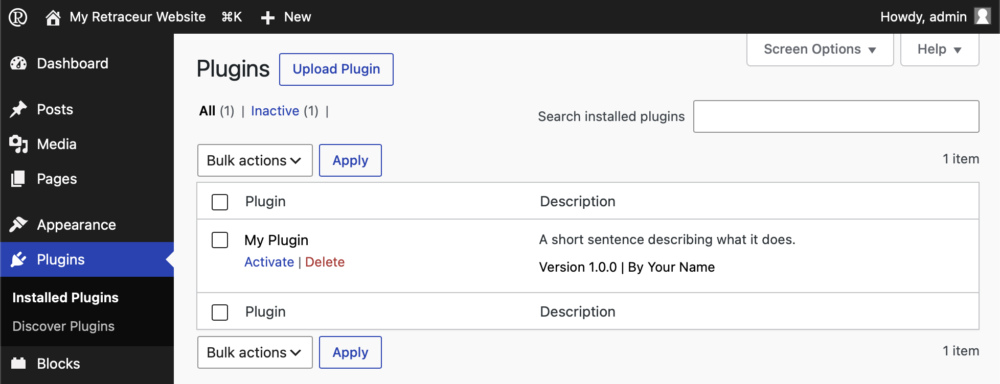

import { FileTree } from '@astrojs/starlight/components';
import { Code } from '@astrojs/starlight/components';

export const pluginCode = `<?php
/**
 * Plugin Name: My Plugin
 * Description: A short sentence describing what it does.
 * Version: 1.0.0
 * Author: Your Name
 * Requires Retraceur: 4.0.0
 */
`;
export const pluginFileName = 'my-plugin/my-plugin.php';

export const blockCode = `<?php
/**
 * Plugin Name: My Plugin
 * Plugin Type: block
 * Description: A short sentence describing what it does.
 * Version: 1.0.0
 * Author: Your Name
 * Requires Retraceur: 4.0.0
 */
`;
export const blockFileName = 'my-block/my-block.php';
export const highlight = `Plugin Type: block`;

Retraceur can be extended in two complementary ways: Plugins and Blocks. Both are, technically, the same kind of resource — a set of PHP (it can also include JavaScript, CSS, etc...) files, both located into the `/wp-content/plugins` directory of your Website. What differs is the purpose they serve.

- A Plugin enriches Retraceur's features: it can add a new setting, a new Administration screen, change how something works behind the scenes, and so on.
- A Block enriches the writing experience: it gives you a new way to compose your posts, your pages, or the layout of your site directly from the Block Editor.

Because of this difference in purpose, Plugins are managed from the Plugins administration screen, while Blocks are managed from the Blocks administration screen. Under the hood though, a Block is a Plugin: one that happens to declare itself as such, as you'll see below.

## Everything starts with a single PHP file

Whether you are building a Plugin or a Block, everything begins with one main PHP file — the one Retraceur will load first, often called the "boot" file. This file must contain a header comment describing your project: its name, its version, who maintains it, which versions of Retraceur it supports, and so on.

This header is what Retraceur reads to list your project in its administration screens. Nothing else is required to get started: as soon as a valid header is found, your Plugin or Block appears — ready to be activated.

Here is a minimal, valid header for a Plugin:

<Code code={pluginCode} lang="php" title={pluginFileName} />

To turn this into a Block instead, add a single line: `Plugin Type: block`.

<Code code={blockCode} lang="php" title={blockFileName} mark={highlight} />

## Recommended file structure

A single PHP file is enough to get going, but a project meant to be shared and maintained over time benefits from a bit more structure. Retraceur hosts its own source code on GitHub, and following the conventions of that ecosystem is recommended for your Plugins and Blocks too.

<FileTree>

- index.php
- ...
- wp-content/
  - index.php
  - ...
  - plugins/
    - my-plugin/
      - my-plugin.php
      - README.md
	  - CHANGELOG.md
	  - CONTRIBUTING.md
	  - CODE_OF_CONDUCT.md
	  - SECURITY.md
	  - LICENSE.md
	  - ...
- ...

</FileTree>

None of these additional files are read by Retraceur — they exist for the people who will use, install, and possibly contribute to your project.

| Markdown File | Description |
| --- | --- |
| **README.md** | Introduces what your Plugin or Block does and how to install it. |
| **CHANGELOG.md** | Keeps track of what changed between versions. |
| **CONTRIBUTING.md** | Explain how others can help. |
| **CODE_OF_CONDUCT.md** | Explain how others should behave while contributing. |
| **SECURITY.md** | Tells people how to report a vulnerability responsibly. |
| **LICENSE.md** | Clarifies under which terms your code can be reused. As Retraceur is licensed under the GNU GPL v2.0: make sure the License you choose is compliant with it. |

## Ready to share it?
 
If you chose to host your Plugin or Block's code on GitHub, you can go one step further: make it discoverable, installable and upgradable from any Retraceur website, without publishing anything anywhere else.
 
[Learn how to share your Plugin or Block →](./publish)